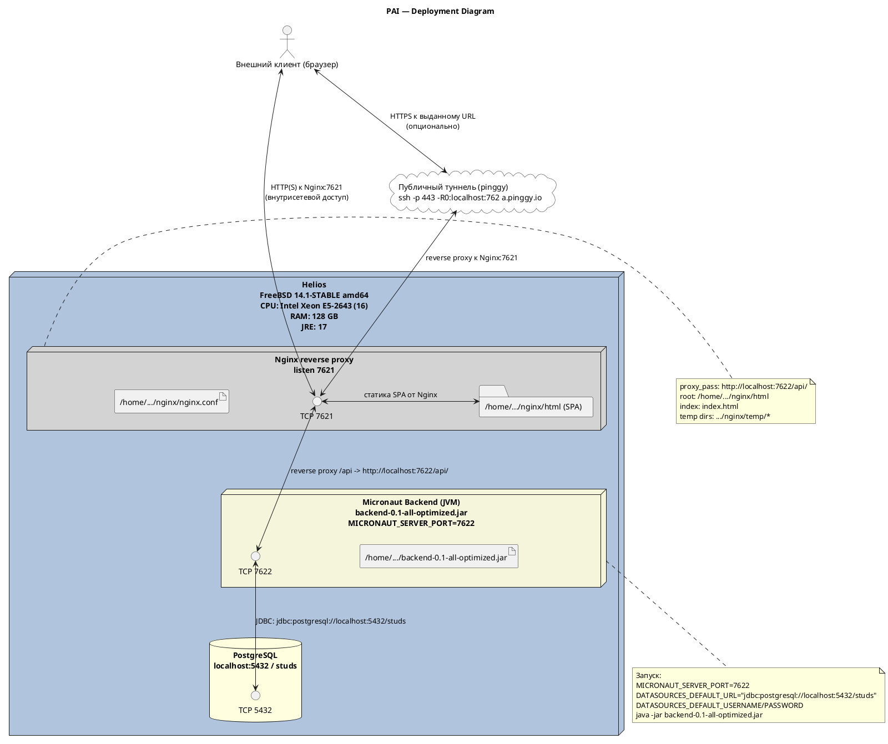

```plantuml-svg
@startuml
title PAI — Deployment Diagram 

skinparam nodesep 150
skinparam ranksep 150
skinparam packageStyle rectangle

actor "Внешний клиент (браузер)" as Client

node "Helios\nFreeBSD 14.1-STABLE amd64\nCPU: Intel Xeon E5-2643 (16)\nRAM: 128 GB\nJRE: 17" as Helios #LightSteelBlue {
  node "Nginx reverse proxy\nlisten 7621" as Nginx #LightGray {
    artifact "/home/.../nginx/nginx.conf" as nginx_conf
    folder  "/home/.../nginx/html (SPA)" as FE
    interface "TCP 7621" as p7621
  }

  node "Micronaut Backend (JVM)\nbackend-0.1-all-optimized.jar\nMICRONAUT_SERVER_PORT=7622" as Backend #Beige {
    artifact "/home/.../backend-0.1-all-optimized.jar" as Jar
    interface "TCP 7622" as p7622
  }

  database "PostgreSQL\nlocalhost:5432 / studs" as PG #LightYellow {
    interface "TCP 5432" as p5432
  }
}

cloud "Публичный туннель (pinggy)\nssh -p 443 -R0:localhost:762 a.pinggy.io" as Tunnel #White

' --- внешние соединения ---
Client <-down-> Tunnel : HTTPS к выданному URL\n(опционально)
Tunnel <-down-> p7621 : reverse proxy к Nginx:7621

Client <-right-> p7621 : HTTP(S) к Nginx:7621\n(внутрисетевой доступ)

' --- внутри Helios ---
p7621 <-down-> p7622 : reverse proxy /api -> http://localhost:7622/api/
FE <-left-> p7621 : статика SPA от Nginx
p7622 <-down-> p5432 : JDBC: jdbc:postgresql://localhost:5432/studs

' --- примечания к конфигу/запуску ---
note right of Nginx
  proxy_pass: http://localhost:7622/api/
  root: /home/.../nginx/html
  index: index.html
  temp dirs: .../nginx/temp/*
end note

note bottom of Backend
  Запуск:
  MICRONAUT_SERVER_PORT=7622
  DATASOURCES_DEFAULT_URL="jdbc:postgresql://localhost:5432/studs"
  DATASOURCES_DEFAULT_USERNAME/PASSWORD
  java -jar backend-0.1-all-optimized.jar
end note

@enduml

```