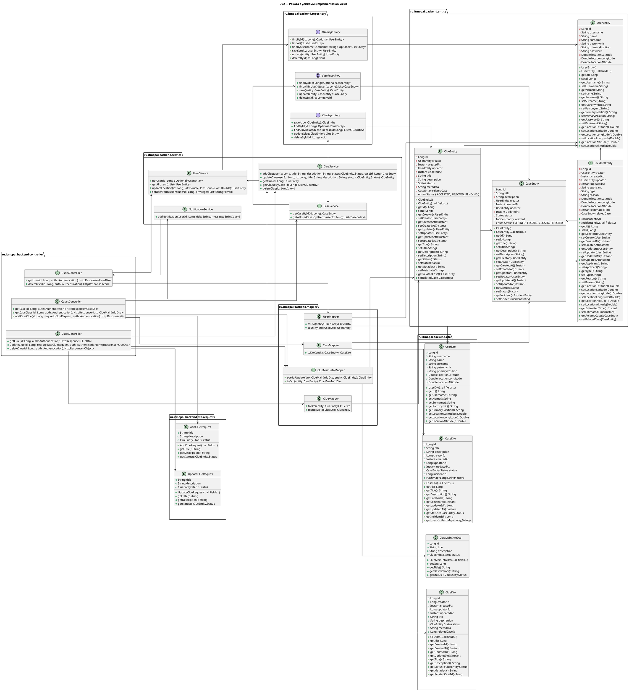

```plantuml
@startuml
title UC2 — Работа с уликами (Implementation View)
left to right direction
skinparam linetype ortho
skinparam actorStyle awesome
skinparam nodesep 60
skinparam ranksep 60


package "ru.itmopai.backend.controller" as controller {
  class CluesController {
    +getClue(id: Long, auth: Authentication): HttpResponse<ClueDto>
    +updateClue(id: Long, req: UpdateClueRequest, auth: Authentication): HttpResponse<ClueDto>
    +deleteClue(id: Long, auth: Authentication): HttpResponse<Object>
  }

  class UsersController {
    +getUser(id: Long, auth: Authentication): HttpResponse<UserDto>
    +deleteUser(id: Long, auth: Authentication): HttpResponse<Void>
  }

  class CasesController {
    +getCase(id: Long, auth: Authentication): HttpResponse<CaseDto>
    +getCaseClues(id: Long, auth: Authentication): HttpResponse<List<ClueMainInfoDto>>
    +addCaseClue(id: Long, req: AddClueRequest, auth: Authentication): HttpResponse<?>
  }
}

package "ru.itmopai.backend.service" as application {
  class ClueService {
    +addClue(userId: Long, title: String, description: String, status: ClueEntity.Status, caseId: Long): ClueEntity
    +updateClue(userId: Long, id: Long, title: String, description: String, status: ClueEntity.Status): ClueEntity
    +getClue(id: Long): ClueEntity
    +getAllClueByCase(id: Long): List<ClueEntity>
    +deleteClue(id: Long): void
  }
  class CaseService {
    +getCaseById(id: Long): CaseEntity
    +getAllUserCasesByUserId(userId: Long): List<CaseEntity>
  }
  class UserService {
    +getUser(id: Long): Optional<UserEntity>
    +getAllUsers(): List<UserEntity>
    +updateLocation(id: Long, lat: Double, lon: Double, alt: Double): UserEntity
    +setUserPermissions(userId: Long, privileges: List<String>): void
  }
  class NotificationService {
    +addNotification(userId: Long, title: String, message: String): void
  }
}

package "ru.itmopai.backend.repository" as repository {
  interface ClueRepository {
    +save(clue: ClueEntity): ClueEntity
    +findById(id: Long): Optional<ClueEntity>
    +findAllByRelatedCase_Id(caseId: Long): List<ClueEntity>
    +update(clue: ClueEntity): ClueEntity
    +deleteById(id: Long): void
  }
  interface CaseRepository {
    +findById(id: Long): Optional<CaseEntity>
    +findAllByUserId(userId: Long): List<CaseEntity>
    +save(entity: CaseEntity): CaseEntity
    +update(entity: CaseEntity): CaseEntity
    +deleteById(id: Long): void
  }
  interface UserRepository {
    +findById(id: Long): Optional<UserEntity>
    +findAll(): List<UserEntity>
    +findByUsername(username: String): Optional<UserEntity>
    +save(entity: UserEntity): UserEntity
    +update(entity: UserEntity): UserEntity
    +deleteById(id: Long): void
  }
}

package "ru.itmopai.backend.entity" as entity {
  class UserEntity {
    -Long id
    -String username
    -String name
    -String surname
    -String patronymic
    -String primaryPosition
    -String password
    -Double locationLatitude
    -Double locationLongitude
    -Double locationAltitude
    +UserEntity()
    +UserEntity(...all fields...)
    +getId(): Long
    +setId(Long)
    +getUsername(): String
    +setUsername(String)
    +getName(): String
    +setName(String)
    +getSurname(): String
    +setSurname(String)
    +getPatronymic(): String
    +setPatronymic(String)
    +getPrimaryPosition(): String
    +setPrimaryPosition(String)
    +getPassword(): String
    +setPassword(String)
    +getLocationLatitude(): Double
    +setLocationLatitude(Double)
    +getLocationLongitude(): Double
    +setLocationLongitude(Double)
    +getLocationAltitude(): Double
    +setLocationAltitude(Double)
  }

  class CaseEntity {
    -Long id
    -String title
    -String description
    -UserEntity creator
    -Instant createdAt
    -UserEntity updator
    -Instant updatedAt
    -Status status
    -IncidentEntity incident
    +CaseEntity()
    +CaseEntity(...all fields...)
    +getId(): Long
    +setId(Long)
    +getTitle(): String
    +setTitle(String)
    +getDescription(): String
    +setDescription(String)
    +getCreator(): UserEntity
    +setCreator(UserEntity)
    +getCreatedAt(): Instant
    +setCreatedAt(Instant)
    +getUpdator(): UserEntity
    +setUpdator(UserEntity)
    +getUpdatedAt(): Instant
    +setUpdatedAt(Instant)
    +getStatus(): Status
    +setStatus(Status)
    +getIncident(): IncidentEntity
    +setIncident(IncidentEntity)
    enum Status { OPENED, FROZEN, CLOSED, REJECTED }
  }

  class ClueEntity {
    -Long id
    -UserEntity creator
    -Instant createdAt
    -UserEntity updator
    -Instant updatedAt
    -String title
    -String description
    -Status status
    -String metadata
    -CaseEntity relatedCase
    +ClueEntity()
    +ClueEntity(...all fields...)
    +getId(): Long
    +setId(Long)
    +getCreator(): UserEntity
    +setCreator(UserEntity)
    +getCreatedAt(): Instant
    +setCreatedAt(Instant)
    +getUpdator(): UserEntity
    +setUpdator(UserEntity)
    +getUpdatedAt(): Instant
    +setUpdatedAt(Instant)
    +getTitle(): String
    +setTitle(String)
    +getDescription(): String
    +setDescription(String)
    +getStatus(): Status
    +setStatus(Status)
    +getMetadata(): String
    +setMetadata(String)
    +getRelatedCase(): CaseEntity
    +setRelatedCase(CaseEntity)
    enum Status { ACCEPTED, REJECTED, PENDING }
  }

  class IncidentEntity {
    -Long id
    -UserEntity creator
    -Instant createdAt
    -UserEntity updator
    -Instant updatedAt
    -String applicant
    -String type
    -String reason
    -Double locationLatitude
    -Double locationLongitude
    -Double locationAltitude
    -Instant estimatedTime
    -CaseEntity relatedCase
    +IncidentEntity()
    +IncidentEntity(...all fields...)
    +getId(): Long
    +setId(Long)
    +getCreator(): UserEntity
    +setCreator(UserEntity)
    +getCreatedAt(): Instant
    +setCreatedAt(Instant)
    +getUpdator(): UserEntity
    +setUpdator(UserEntity)
    +getUpdatedAt(): Instant
    +setUpdatedAt(Instant)
    +getApplicant(): String
    +setApplicant(String)
    +getType(): String
    +setType(String)
    +getReason(): String
    +setReason(String)
    +getLocationLatitude(): Double
    +setLocationLatitude(Double)
    +getLocationLongitude(): Double
    +setLocationLongitude(Double)
    +getLocationAltitude(): Double
    +setLocationAltitude(Double)
    +getEstimatedTime(): Instant
    +setEstimatedTime(Instant)
    +getRelatedCase(): CaseEntity
    +setRelatedCase(CaseEntity)
  }
}

package "ru.itmopai.backend.dto" as dto {
  class CaseDto {
    +Long id
    +String title
    +String description
    +Long creatorId
    +Instant createdAt
    +Long updatorId
    +Instant updatedAt
    +CaseEntity.Status status
    +Long incidentId
    +HashMap<Long,String> users
    +CaseDto(...all fields...)
    +getId(): Long
    +getTitle(): String
    +getDescription(): String
    +getCreatorId(): Long
    +getCreatedAt(): Instant
    +getUpdatorId(): Long
    +getUpdatedAt(): Instant
    +getStatus(): CaseEntity.Status
    +getIncidentId(): Long
    +getUsers(): HashMap<Long,String>
  }

  class ClueDto {
    +Long id
    +Long creatorId
    +Instant createdAt
    +Long updatorId
    +Instant updatedAt
    +String title
    +String description
    +ClueEntity.Status status
    +String metadata
    +Long relatedCaseId
    +ClueDto(...all fields...)
    +getId(): Long
    +getCreatorId(): Long
    +getCreatedAt(): Instant
    +getUpdatorId(): Long
    +getUpdatedAt(): Instant
    +getTitle(): String
    +getDescription(): String
    +getStatus(): ClueEntity.Status
    +getMetadata(): String
    +getRelatedCaseId(): Long
  }

  class ClueMainInfoDto {
    +Long id
    +String title
    +String description
    +ClueEntity.Status status
    +ClueMainInfoDto(...all fields...)
    +getId(): Long
    +getTitle(): String
    +getDescription(): String
    +getStatus(): ClueEntity.Status
  }

  class UserDto {
    +Long id
    +String username
    +String name
    +String surname
    +String patronymic
    +String primaryPosition
    +Double locationLatitude
    +Double locationLongitude
    +Double locationAltitude
    +UserDto(...all fields...)
    +getId(): Long
    +getUsername(): String
    +getName(): String
    +getSurname(): String
    +getPatronymic(): String
    +getPrimaryPosition(): String
    +getLocationLatitude(): Double
    +getLocationLongitude(): Double
    +getLocationAltitude(): Double
  }
}

package "ru.itmopai.backend.dto.request" as request {
  class AddClueRequest {
    +String title
    +String description
    +ClueEntity.Status status
    +AddClueRequest(...all fields...)
    +getTitle(): String
    +getDescription(): String
    +getStatus(): ClueEntity.Status
  }
  class UpdateClueRequest {
    +String title
    +String description
    +ClueEntity.Status status
    +UpdateClueRequest(...all fields...)
    +getTitle(): String
    +getDescription(): String
    +getStatus(): ClueEntity.Status
  }
}

package "ru.itmopai.backend.mapper" as mapper {
  class CaseMapper {
    +toDto(entity: CaseEntity): CaseDto
  }
  class ClueMapper {
    +toDto(entity: ClueEntity): ClueDto
    +toEntity(dto: ClueDto): ClueEntity
  }
  class ClueMainInfoMapper {
    +partialUpdate(dto: ClueMainInfoDto, entity: ClueEntity): ClueEntity
    +toDto(entity: ClueEntity): ClueMainInfoDto
  }
  class UserMapper {
    +toDto(entity: UserEntity): UserDto
    +toEntity(dto: UserDto): UserEntity
  }
}

controller -[hidden]-> application
application -[hidden]-> repository
repository -[hidden]-> entity
entity -[hidden]-> dto
dto -[hidden]-> request
request -[hidden]-> mapper

CluesController -right-> ClueService
CluesController -down-> ClueMapper
CluesController -down-> ClueMainInfoMapper
CluesController -down-> UpdateClueRequest
UsersController -right-> UserService
UsersController -down-> UserMapper

CasesController -right-> CaseService
CasesController -down-> CaseMapper
CasesController -right-> ClueService
CasesController -down-> ClueMainInfoMapper
CasesController -down-> AddClueRequest
CasesController -down-> NotificationService

ClueService -right-> ClueRepository
ClueService -up-> UserService
ClueService -right-> CaseService
CaseService -right-> CaseRepository
UserService -right-> UserRepository
NotificationService -[norank]-> UsersController

ClueRepository -down-> ClueEntity
CaseRepository -down-> CaseEntity
UserRepository -down-> UserEntity

CaseMapper -down-> CaseDto
CaseMapper -down-> CaseEntity
ClueMapper -down-> ClueDto
ClueMapper -down-> ClueEntity
ClueMainInfoMapper -down-> ClueMainInfoDto
ClueMainInfoMapper -down-> ClueEntity
UserMapper -down-> UserDto
UserMapper -down-> UserEntity

ClueEntity -right-> UserEntity
ClueEntity -down-> CaseEntity
CaseEntity -down-> IncidentEntity
IncidentEntity -right-> UserEntity
IncidentEntity -up-> CaseEntity
@enduml

```