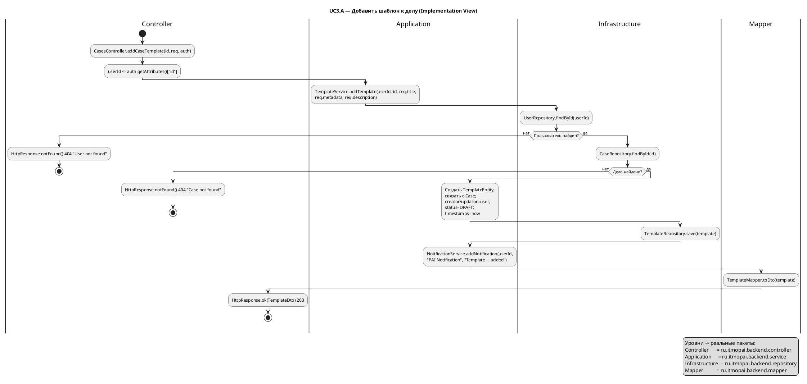
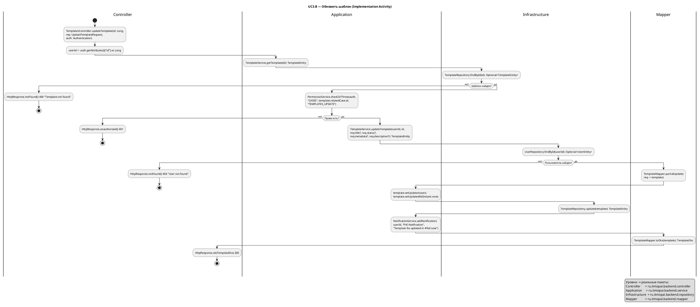

```plantuml-svg
@startuml
title UC3.A — Добавить шаблон к делу (Implementation View)
skinparam linetype ortho
skinparam nodesep 45
skinparam ranksep 45


|Controller|
start
:CasesController.addCaseTemplate(id, req, auth);
:userId <- auth.getAttributes()["id"];

|Application|
:TemplateService.addTemplate(userId, id, req.title,\nreq.metadata, req.description);

|Infrastructure|
:UserRepository.findById(userId);

if (Пользователь найден?) then (нет)
  |Controller|
  :HttpResponse.notFound() 404 "User not found";
  stop
else (да)
  |Infrastructure|
  :CaseRepository.findById(id);

  if (Дело найдено?) then (нет)
    |Controller|
    :HttpResponse.notFound() 404 "Case not found";
    stop
  else (да)
    |Application|
    :Создать TemplateEntity;\nсвязать с Case;\ncreator/updator=user;\nstatus=DRAFT;\ntimestamps=now;

    |Infrastructure|
    :TemplateRepository.save(template);

    |Application|
    :NotificationService.addNotification(userId,\n"PAI Notification", "Template ... added");

    |Mapper|
    :TemplateMapper.toDto(template);

    |Controller|
    :HttpResponse.ok(TemplateDto) 200;
    stop
  endif
endif

legend right
  Уровни → реальные пакеты:
  Controller      = ru.itmopai.backend.controller
  Application     = ru.itmopai.backend.service
  Infrastructure  = ru.itmopai.backend.repository
  Mapper          = ru.itmopai.backend.mapper
endlegend

@enduml

```

```plantuml-svg
@startuml
title UC3.B — Обновить шаблон (Implementation Activity)
skinparam linetype ortho
skinparam nodesep 45
skinparam ranksep 45

|Controller|
start
:TemplatesController.updateTemplate(id: Long,\nreq: UpdateTemplateRequest,\nauth: Authentication);
:userId <- auth.getAttributes()["id"] as Long;

|Application|
:TemplateService.getTemplate(id): TemplateEntity;

|Infrastructure|
:TemplateRepository.findById(id): Optional<TemplateEntity>;

if (Шаблон найден?) then (нет)
  |Controller|
  :HttpResponse.notFound() 404 "Template not found";
  stop
else (да)
  |Application|
  :PermissionService.checkOrThrow(auth,\n"CASES", template.relatedCase.id,\n"TEMPLATES_UPDATE");

  if (Права есть?) then (нет)
    |Controller|
    :HttpResponse.unauthorized() 401;
    stop
  else (да)
    |Application|
    :TemplateService.updateTemplate(userId, id,\nreq.title?, req.status?,\nreq.metadata?, req.description?): TemplateEntity;

    |Infrastructure|
    :UserRepository.findById(userId): Optional<UserEntity>;

    if (Пользователь найден?) then (нет)
      |Controller|
      :HttpResponse.notFound() 404 "User not found";
      stop
    else (да)
      |Mapper|
      :TemplateMapper.partialUpdate(\nreq -> template);

      |Application|
      :template.setUpdator(user);\ntemplate.setUpdatedAt(Instant.now);

      |Infrastructure|
      :TemplateRepository.update(template): TemplateEntity;

      |Application|
      :NotificationService.addNotification(\nuserId, "PAI Notification",\n"Template %s updated in #%d case");

      |Mapper|
      :TemplateMapper.toDto(template): TemplateDto;

      |Controller|
      :HttpResponse.ok(TemplateDto) 200;
      stop
    endif
  endif
endif

legend right
  Уровни → реальные пакеты:
  Controller      = ru.itmopai.backend.controller
  Application     = ru.itmopai.backend.service
  Infrastructure  = ru.itmopai.backend.repository
  Mapper          = ru.itmopai.backend.mapper
endlegend
@enduml

```