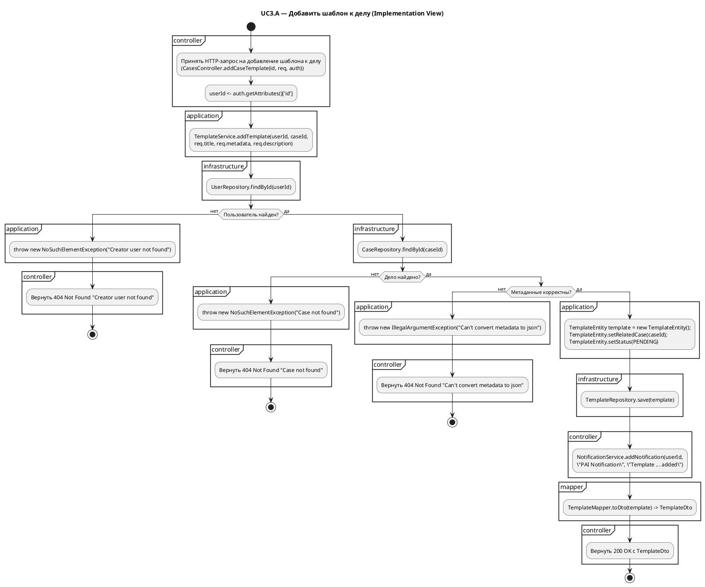
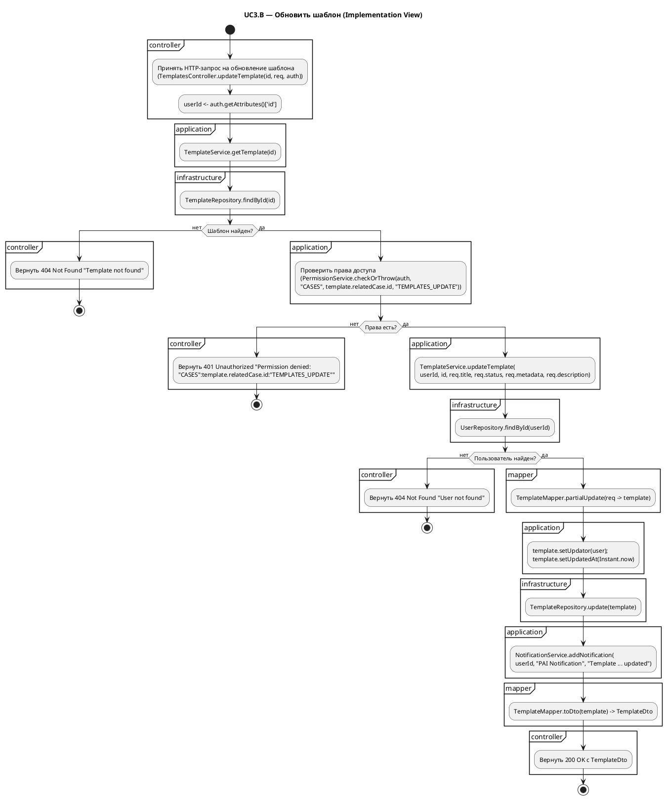

```plantuml-svg
@startuml
title UC3.A — Добавить шаблон к делу (Implementation View)
skinparam linetype ortho
skinparam nodesep 45
skinparam ranksep 45

start

partition "controller" {
  :Принять HTTP-запрос на добавление шаблона к делу\n(CasesController.addCaseTemplate(id, req, auth));
  :userId <- auth.getAttributes()['id'];
}

partition "application" {
  :TemplateService.addTemplate(userId, caseId,\nreq.title, req.metadata, req.description);
}

partition "infrastructure" {
  :UserRepository.findById(userId);
}

if (Пользователь найден?) then (нет)
  partition "application" {
    :throw new NoSuchElementException("Creator user not found");
  }
  partition "controller" {
    :Вернуть 404 Not Found "Creator user not found";
  }
  stop
else (да)
  partition "infrastructure" {
    :CaseRepository.findById(caseId);
  }

  if (Дело найдено?) then (нет)
    partition "application" {
      :throw new NoSuchElementException("Case not found");
    }
    partition "controller" {
      :Вернуть 404 Not Found "Case not found";
    }
    stop
  else (да)
	if (Метаданные корректны?) then (нет)
		partition "application" {
	      :throw new IllegalArgumentException("Can't convert metadata to json");
	    }
	    partition "controller" {
	      :Вернуть 404 Not Found "Can't convert metadata to json";
	    }
		stop
	else (да)
		partition "application" {
		  :TemplateEntity template = new TemplateEntity();\nTemplateEntity.setRelatedCase(caseId);\nTemplateEntity.setStatus(PENDING);
		}
		partition "infrastructure" {
		  :TemplateRepository.save(template);
		}
		partition "controller" {
		  :NotificationService.addNotification(userId,\n\"PAI Notification\", \"Template ... added\");
		}
		partition "mapper" {
		  :TemplateMapper.toDto(template) -> TemplateDto;
		}
		partition "controller" {
		  :Вернуть 200 OK с TemplateDto;
		}
		stop
	endif
  endif
endif

@enduml

```

```plantuml-svg
@startuml
title UC3.B — Обновить шаблон (Implementation View)
skinparam linetype ortho
skinparam nodesep 45
skinparam ranksep 45

start

partition "controller" {
  :Принять HTTP-запрос на обновление шаблона\n(TemplatesController.updateTemplate(id, req, auth));
  :userId <- auth.getAttributes()['id'];
}

partition "application" {
  :TemplateService.getTemplate(id);
}

partition "infrastructure" {
  :TemplateRepository.findById(id);
}

if (Шаблон найден?) then (нет)
  partition "controller" {
    :Вернуть 404 Not Found "Template not found";
  }
  stop
else (да)
  partition "application" {
    :Проверить права доступа\n(PermissionService.checkOrThrow(auth,\n"CASES", template.relatedCase.id, "TEMPLATES_UPDATE"));
  }

  if (Права есть?) then (нет)
    partition "controller" {
      :Вернуть 401 Unauthorized "Permission denied:\n"CASES":template.relatedCase.id:"TEMPLATES_UPDATE"";
    }
    stop
  else (да)
    partition "application" {
      :TemplateService.updateTemplate(\nuserId, id, req.title, req.status, req.metadata, req.description);
    }
    partition "infrastructure" {
      :UserRepository.findById(userId);
    }

    if (Пользователь найден?) then (нет)
      partition "controller" {
        :Вернуть 404 Not Found "User not found";
      }
      stop
    else (да)
      partition "mapper" {
        :TemplateMapper.partialUpdate(req -> template);
      }
      partition "application" {
        :template.setUpdator(user);\ntemplate.setUpdatedAt(Instant.now);
      }
      partition "infrastructure" {
        :TemplateRepository.update(template);
      }
      partition "application" {
        :NotificationService.addNotification(\nuserId, "PAI Notification", "Template ... updated");
      }
      partition "mapper" {
        :TemplateMapper.toDto(template) -> TemplateDto;
      }
      partition "controller" {
        :Вернуть 200 OK с TemplateDto;
      }
      stop
    endif
  endif
endif
@enduml

```