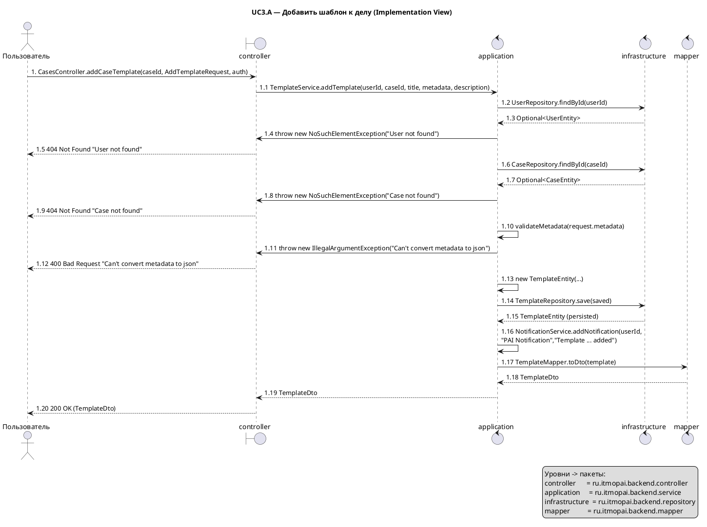
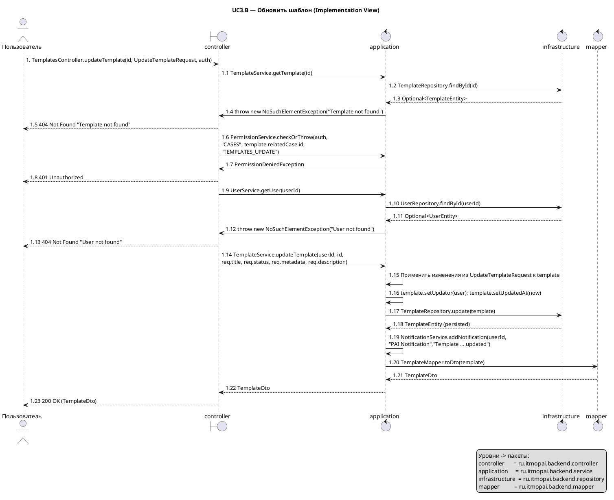

```plantuml-svg
@startuml
title UC3.A — Добавить шаблон к делу (Implementation View)

actor Пользователь as U
boundary "controller" as CTRL
control  "application" as APP
control  "infrastructure" as INFRA
control  "mapper" as MAP

U    -> CTRL  : 1. CasesController.addCaseTemplate(caseId, AddTemplateRequest, auth)
CTRL -> APP   : 1.1 TemplateService.addTemplate(userId, caseId, title, metadata, description)

APP  -> INFRA : 1.2 UserRepository.findById(userId)
INFRA --> APP : 1.3 Optional<UserEntity>
APP  -> CTRL  : 1.4 throw new NoSuchElementException("User not found")
CTRL --> U    : 1.5 404 Not Found "User not found"

APP  -> INFRA : 1.6 CaseRepository.findById(caseId)
INFRA --> APP : 1.7 Optional<CaseEntity>
APP  -> CTRL  : 1.8 throw new NoSuchElementException("Case not found")
CTRL --> U    : 1.9 404 Not Found "Case not found"

APP  -> APP   : 1.10 validateMetadata(request.metadata)
APP  -> CTRL  : 1.11 throw new IllegalArgumentException("Can't convert metadata to json")
CTRL --> U    : 1.12 400 Bad Request "Can't convert metadata to json"

APP  -> APP   : 1.13 new TemplateEntity(...)
APP  -> INFRA : 1.14 TemplateRepository.save(saved)
INFRA --> APP : 1.15 TemplateEntity (persisted)

APP  -> APP   : 1.16 NotificationService.addNotification(userId,\n"PAI Notification","Template ... added")

APP  -> MAP   : 1.17 TemplateMapper.toDto(template)
MAP  --> APP  : 1.18 TemplateDto
APP  --> CTRL : 1.19 TemplateDto
CTRL --> U    : 1.20 200 OK (TemplateDto)

legend right
  Уровни -> пакеты:
  controller      = ru.itmopai.backend.controller
  application     = ru.itmopai.backend.service
  infrastructure  = ru.itmopai.backend.repository
  mapper          = ru.itmopai.backend.mapper
endlegend
@enduml

```

```plantuml-svg
@startuml
title UC3.B — Обновить шаблон (Implementation View)

actor Пользователь as U
boundary "controller" as CTRL
control  "application" as APP
control  "infrastructure" as INFRA
control  "mapper" as MAP

U    -> CTRL : 1. TemplatesController.updateTemplate(id, UpdateTemplateRequest, auth)
CTRL -> APP  : 1.1 TemplateService.getTemplate(id)
APP  -> INFRA: 1.2 TemplateRepository.findById(id)
INFRA --> APP: 1.3 Optional<TemplateEntity>
APP  -> CTRL : 1.4 throw new NoSuchElementException("Template not found")
CTRL --> U   : 1.5 404 Not Found "Template not found"

CTRL -> APP  : 1.6 PermissionService.checkOrThrow(auth,\n"CASES", template.relatedCase.id,\n"TEMPLATES_UPDATE")
APP  -> CTRL : 1.7 PermissionDeniedException
CTRL --> U   : 1.8 401 Unauthorized

CTRL -> APP  : 1.9 UserService.getUser(userId)
APP  -> INFRA: 1.10 UserRepository.findById(userId)
INFRA --> APP: 1.11 Optional<UserEntity>
APP  -> CTRL : 1.12 throw new NoSuchElementException("User not found")
CTRL --> U   : 1.13 404 Not Found "User not found"

CTRL -> APP  : 1.14 TemplateService.updateTemplate(userId, id,\nreq.title, req.status, req.metadata, req.description)
APP  -> APP  : 1.15 Применить изменения из UpdateTemplateRequest к template
APP  -> APP  : 1.16 template.setUpdator(user); template.setUpdatedAt(now)
APP  -> INFRA: 1.17 TemplateRepository.update(template)
INFRA --> APP: 1.18 TemplateEntity (persisted)

APP  -> APP  : 1.19 NotificationService.addNotification(userId,\n"PAI Notification","Template ... updated")

APP  -> MAP  : 1.20 TemplateMapper.toDto(template)
MAP  --> APP : 1.21 TemplateDto
APP  --> CTRL: 1.22 TemplateDto
CTRL --> U   : 1.23 200 OK (TemplateDto)

legend right
  Уровни -> пакеты:
  controller      = ru.itmopai.backend.controller
  application     = ru.itmopai.backend.service
  infrastructure  = ru.itmopai.backend.repository
  mapper          = ru.itmopai.backend.mapper
endlegend
@enduml

```
