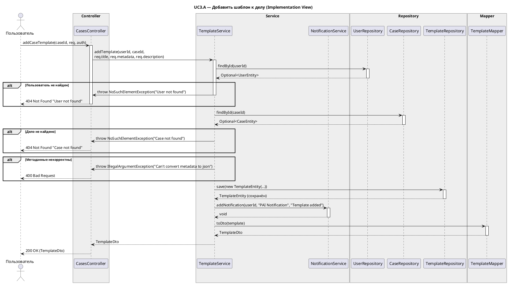
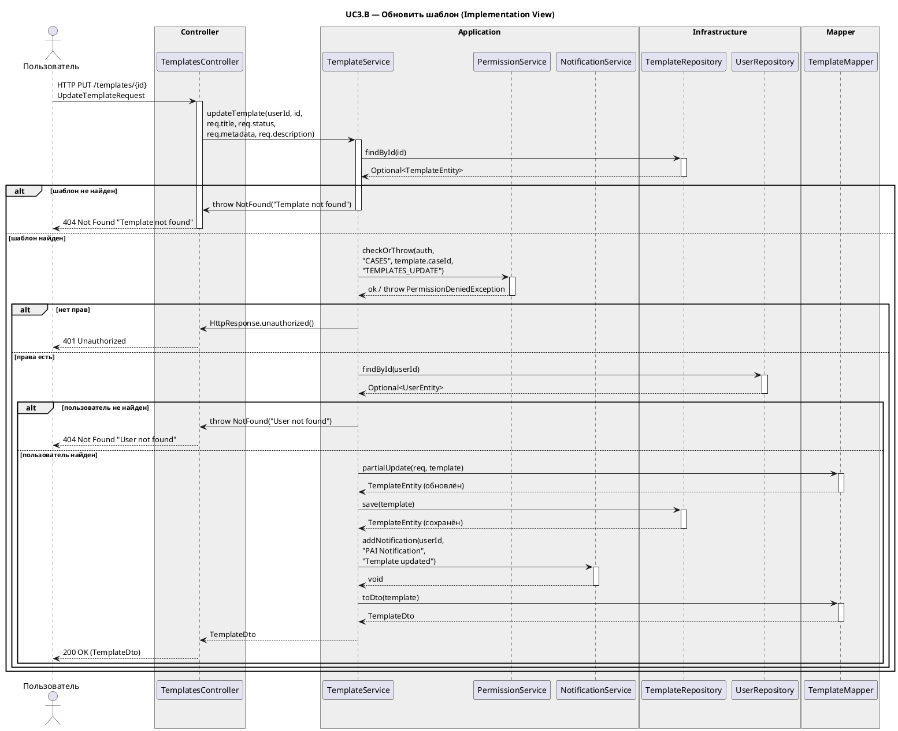

```plantuml-svg
@startuml
title UC3.A — Добавить шаблон к делу (Implementation View)

actor Пользователь as U
box "Controller" #EEEEEE
  participant CasesController
end box
box "Service" #EEEEEE
  participant TemplateService
  participant NotificationService
end box
box "Repository" #EEEEEE
  participant UserRepository
  participant CaseRepository
  participant TemplateRepository
end box
box "Mapper" #EEEEEE
  participant TemplateMapper
end box

U -> CasesController : addCaseTemplate(caseId, req, auth)
activate CasesController

CasesController -> TemplateService : addTemplate(userId, caseId,\nreq.title, req.metadata, req.description)
activate TemplateService

TemplateService -> UserRepository : findById(userId)
activate UserRepository
UserRepository --> TemplateService : Optional<UserEntity>
deactivate UserRepository

alt Пользователь не найден
  TemplateService -> CasesController : throw NoSuchElementException("User not found")
  deactivate TemplateService
  CasesController --> U : 404 Not Found "User not found"
  deactivate CasesController
end

TemplateService -> CaseRepository : findById(caseId)
activate CaseRepository
CaseRepository --> TemplateService : Optional<CaseEntity>
deactivate CaseRepository

alt Дело не найдено
  TemplateService -> CasesController : throw NoSuchElementException("Case not found")
  deactivate TemplateService
  CasesController --> U : 404 Not Found "Case not found"
  deactivate CasesController
end

alt Метаданные некорректны
  TemplateService -> CasesController : throw IllegalArgumentException("Can't convert metadata to json")
  deactivate TemplateService
  CasesController --> U : 400 Bad Request
  deactivate CasesController
end

TemplateService -> TemplateRepository : save(new TemplateEntity(...))
activate TemplateRepository
TemplateRepository --> TemplateService : TemplateEntity (сохранён)
deactivate TemplateRepository

TemplateService -> NotificationService : addNotification(userId, "PAI Notification", "Template added")
activate NotificationService
NotificationService --> TemplateService : void
deactivate NotificationService

TemplateService -> TemplateMapper : toDto(template)
activate TemplateMapper
TemplateMapper --> TemplateService : TemplateDto
deactivate TemplateMapper

TemplateService --> CasesController : TemplateDto
deactivate TemplateService

CasesController --> U : 200 OK (TemplateDto)
deactivate CasesController

@enduml

```

```plantuml-svg
@startuml
title UC3.B — Обновить шаблон (Implementation View)

actor Пользователь as U

box "Controller" #EEEEEE
  participant TemplatesController as C
end box

box "Application" #EEEEEE
  participant TemplateService as S
  participant PermissionService as PS
  participant NotificationService as NS
end box

box "Infrastructure" #EEEEEE
  participant TemplateRepository as TR
  participant UserRepository as UR
end box

box "Mapper" #EEEEEE
  participant TemplateMapper as M
end box

U -> C : HTTP PUT /templates/{id}\nUpdateTemplateRequest
activate C
C -> S : updateTemplate(userId, id,\nreq.title, req.status,\nreq.metadata, req.description)
activate S

S -> TR : findById(id)
activate TR
TR --> S : Optional<TemplateEntity>
deactivate TR

alt шаблон не найден
  S -> C : throw NotFound("Template not found")
  deactivate S
  C --> U : 404 Not Found "Template not found"
  deactivate C
else шаблон найден
  S -> PS : checkOrThrow(auth,\n"CASES", template.caseId,\n"TEMPLATES_UPDATE")
  activate PS
  PS --> S : ok / throw PermissionDeniedException
  deactivate PS

  alt нет прав
    S -> C : HttpResponse.unauthorized()
    deactivate S
    C --> U : 401 Unauthorized
    deactivate C
  else права есть
    S -> UR : findById(userId)
    activate UR
    UR --> S : Optional<UserEntity>
    deactivate UR

    alt пользователь не найден
      S -> C : throw NotFound("User not found")
      deactivate S
      C --> U : 404 Not Found "User not found"
      deactivate C
    else пользователь найден
      S -> M : partialUpdate(req, template)
      activate M
      M --> S : TemplateEntity (обновлён)
      deactivate M

      S -> TR : save(template)
      activate TR
      TR --> S : TemplateEntity (сохранён)
      deactivate TR

      S -> NS : addNotification(userId,\n"PAI Notification",\n"Template updated")
      activate NS
      NS --> S : void
      deactivate NS

      S -> M : toDto(template)
      activate M
      M --> S : TemplateDto
      deactivate M

      S --> C : TemplateDto
      deactivate S
      C --> U : 200 OK (TemplateDto)
      deactivate C
    end
  end
end

@enduml

```