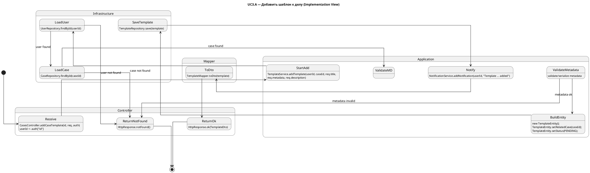

```plantuml-svg
@startuml
title UC3.A — Добавить шаблон к делу (Implementation View)

top to bottom direction
skinparam linetype ortho
skinparam nodesep 150
skinparam ranksep 150

[*] --> Controller.Receive

state "Controller" as Controller {
  state Receive    : CasesController.addCaseTemplate(id, req, auth)\nuserId <- auth["id"]
  state ReturnNotFound  : HttpResponse.notFound()
  state ReturnOk  : HttpResponse.ok(TemplateDto)
}

state "Application" as Application {
  state StartAdd   : TemplateService.addTemplate(userId, caseId, req.title,\nreq.metadata, req.description)
  state ValidateMetadata : validate/serialize metadata
  state BuildEntity   : new TemplateEntity();\nTemplateEntity.setRelatedCase(caseId);\nTemplateEntity.setStatus(PENDING);
  state Notify     : NotificationService.addNotification(userId, "Template ... added")
}

state "Infrastructure" as Infrastructure {
  state LoadUser   : UserRepository.findById(userId)
  state LoadCase   : CaseRepository.findById(caseId)
  state SaveTemplate  : TemplateRepository.save(template)
}

state "Mapper" as Mapper {
  state ToDto      : TemplateMapper.toDto(template)
}

Controller.Receive --> Application.StartAdd
Application.StartAdd --> Infrastructure.LoadUser
Infrastructure.LoadUser --> Controller.ReturnNotFound : user not found
Infrastructure.LoadUser --> Infrastructure.LoadCase : user found
Infrastructure.LoadCase --> Controller.ReturnNotFound : case not found
Infrastructure.LoadCase --> Application.ValidateMD : case found

Application.ValidateMetadata --> Controller.ReturnNotFound : metadata invalid
Application.ValidateMetadata --> Application.BuildEntity  : metadata ok

Application.BuildEntity --> Infrastructure.SaveTemplate
Infrastructure.SaveTemplate --> Application.Notify
Application.Notify --> Mapper.ToDto
Mapper.ToDto --> Controller.ReturnOk

Controller.ReturnNotFound --> [*]
Controller.ReturnOk --> [*]
@enduml

```

```plantuml-svg
@startuml
title UC3.B — Обновить шаблон (Implementation View)

top to bottom direction
skinparam linetype ortho
skinparam nodesep 170
skinparam ranksep 150

[*] --> Controller.Receive

state "Controller" as Controller {
  state Receive        : TemplatesController.updateTemplate(id, req, auth)\nuserId <- auth["id"]
  state ReturnNotAuth      : HttpResponse.unauthorized()
  state ReturnNotFound      : HttpResponse.notFound()
  state ReturnOk      : HttpResponse.ok(TemplateDto)
}

state "Application" as Application {
  state LoadTemplate   : TemplateService.getTemplate(id)
  state CheckPerms     : PermissionService.checkOrThrow(auth, "CASES", caseId, "TEMPLATES_UPDATE")
  state ApplyAudit     : setUpdator(user); setUpdatedAt(now)
  state Notify         : NotificationService.addNotification(userId, "Template updated")
}

state "Infrastructure" as Infrastructure {
  state FindTemplate   : TemplateRepository.findById(id)
  state LoadUpdator    : UserRepository.findById(userId)
  state UpdateTemplate : TemplateRepository.update(template)
}

state "Mapper" as Mapper {
  state PartialUpdate  : TemplateMapper.partialUpdate(req -> template)
  state ToDto          : TemplateMapper.toDto(template)
}

Controller.Receive --> Application.LoadTemplate
Application.LoadTemplate --> Infrastructure.FindTemplate
Infrastructure.FindTemplate --> Controller.ReturnNotFound : not found
Infrastructure.FindTemplate --> Application.CheckPerms : found
Application.CheckPerms --> Controller.ReturnNotAuth : no rights
Application.CheckPerms --> Mapper.PartialUpdate : ok
Mapper.PartialUpdate --> Infrastructure.LoadUpdator
Infrastructure.LoadUpdator --> Controller.ReturnNotFound : not found
Infrastructure.LoadUpdator --> Application.ApplyAudit : found
Application.ApplyAudit --> Infrastructure.UpdateTemplate
Infrastructure.UpdateTemplate --> Application.Notify
Application.Notify --> Mapper.ToDto
Mapper.ToDto --> Controller.ReturnOk

Controller.ReturnNotAuth --> [*]
Controller.ReturnNotFound --> [*]
Controller.ReturnOk --> [*]
@enduml

```