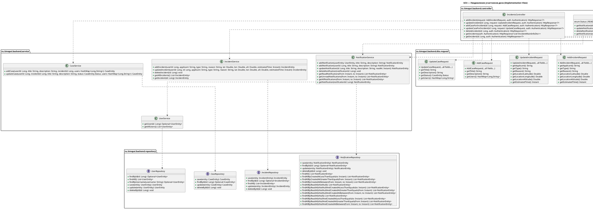

```plantuml-svg
@startuml
title UC4 — Уведомление участников дела (Implementation View)
skinparam linetype ortho
skinparam nodesep 60
skinparam ranksep 60

package "ru.itmopai.backend.controller" as controller {
  class NotificationsController {
    +getNotification(id: Long): HttpResponse<NotificationDto>
    +updateNotification(id: Long, request: UpdateNotificationRequest): HttpResponse<NotificationDto>
    +deleteNotification(id: Long): HttpResponse<Object>
    +getNotifications(status: Status, from: Instant, to: Instant): HttpResponse<List<NotificationDto>>
    enum Status { READ, UNREAD, ALL }
  }

  class IncidentsController {
    +addIncident(request: AddIncidentRequest, auth: Authentication): HttpResponse<?>
    +updateIncident(id: Long, request: UpdateIncidentRequest, auth: Authentication): HttpResponse<?>
    +addCaseForIncident(id: Long, request: AddCaseRequest, auth: Authentication): HttpResponse<?>
    +updateCaseForIncident(id: Long, request: UpdateCaseRequest, auth: Authentication): HttpResponse<?>
    +deleteIncident(id: Long, auth: Authentication): HttpResponse<?>
    +getIncidents(auth: Authentication): HttpResponse<List<IncidentMainInfoDto>>
    +getIncident(id: Long, auth: Authentication): HttpResponse<?>
  }
}

package "ru.itmopai.backend.service" as application {
  class NotificationService {
    +addNotification(userEntity: UserEntity, title: String, description: String): NotificationEntity
    +addNotification(userId: Long, title: String, description: String): NotificationEntity
    +updateNotification(id: Long, title: String, description: String, readAt: Instant): NotificationEntity
    +deleteNotification(notificationId: Long): void
    +getReadNotifications(from: Instant, to: Instant): List<NotificationEntity>
    +getUnreadNotifications(from: Instant, to: Instant): List<NotificationEntity>
    +getAllNotifications(from: Instant, to: Instant): List<NotificationEntity>
    +getNotification(notificationId: Long): NotificationEntity
  }

  class IncidentService {
    +addIncident(userId: Long, applicant: String, type: String, reason: String, lat: Double, lon: Double, alt: Double, estimatedTime: Instant): IncidentEntity
    +updateIncident(userId: Long, id: Long, applicant: String, type: String, reason: String, lat: Double, lon: Double, alt: Double, estimatedTime: Instant): IncidentEntity
    +deleteIncident(id: Long): void
    +getAllIncidents(): List<IncidentEntity>
    +getIncident(id: Long): IncidentEntity
  }

  class CaseService {
    +addCase(userId: Long, title: String, description: String, incidentId: Long, users: HashMap<Long,String>): CaseEntity
    +updateCase(userId: Long, incidentId: Long, title: String, description: String, status: CaseEntity.Status, users: HashMap<Long,String>): CaseEntity
  }

  class UserService {
    +getUser(id: Long): Optional<UserEntity>
    +getAllUsers(): List<UserEntity>
  }
}

package "ru.itmopai.backend.repository" as repository {
  interface NotificationRepository {
    +save(entity: NotificationEntity): NotificationEntity
    +findById(id: Long): Optional<NotificationEntity>
    +update(entity: NotificationEntity): NotificationEntity
    +deleteById(id: Long): void
    +findAll(): List<NotificationEntity>
    +findAllByCreatedAtLessThanEquals(to: Instant): List<NotificationEntity>
    +findAllByCreatedAtGreaterThanEquals(from: Instant): List<NotificationEntity>
    +findAllByCreatedAtBetween(from: Instant, to: Instant): List<NotificationEntity>
    +findAllByReadAtIsNotNull(): List<NotificationEntity>
    +findAllByReadAtIsNotNullAndCreatedAtLessThanEquals(to: Instant): List<NotificationEntity>
    +findAllByReadAtIsNotNullAndCreatedAtGreaterThanEquals(from: Instant): List<NotificationEntity>
    +findAllByReadAtIsNotNullAndCreatedAtBetween(from: Instant, to: Instant): List<NotificationEntity>
    +findAllByReadAtIsNull(): List<NotificationEntity>
    +findAllByReadAtIsNullAndCreatedAtLessThanEquals(to: Instant): List<NotificationEntity>
    +findAllByReadAtIsNullAndCreatedAtGreaterThanEquals(from: Instant): List<NotificationEntity>
    +findAllByReadAtIsNullAndCreatedAtBetween(from: Instant, to: Instant): List<NotificationEntity>
  }

  interface UserRepository {
    +findById(id: Long): Optional<UserEntity>
    +findAll(): List<UserEntity>
    +findByUsername(username: String): Optional<UserEntity>
    +save(entity: UserEntity): UserEntity
    +update(entity: UserEntity): UserEntity
    +deleteById(id: Long): void
  }

  interface IncidentRepository {
    +save(entity: IncidentEntity): IncidentEntity
    +findById(id: Long): Optional<IncidentEntity>
    +findAll(): List<IncidentEntity>
    +update(entity: IncidentEntity): IncidentEntity
    +deleteById(id: Long): void
  }

  interface CaseRepository {
    +save(entity: CaseEntity): CaseEntity
    +findById(id: Long): Optional<CaseEntity>
    +update(entity: CaseEntity): CaseEntity
    +deleteById(id: Long): void
  }
}

package "ru.itmopai.backend.entity" as entity {
  class NotificationEntity {
    -Long id
    -UserEntity user
    -String title
    -String description
    -Instant createdAt
    -Instant readAt
    +NotificationEntity()
    +NotificationEntity(...all fields...)
  }

  class UserEntity {
    -Long id
    -String username
    -String name
    -String surname
    -String patronymic
    -String primaryPosition
    -String password
    -Double locationLatitude
    -Double locationLongitude
    -Double locationAltitude
    +UserEntity()
    +UserEntity(...all fields...)
  }

  class IncidentEntity {
    -Long id
    -UserEntity creator
    -Instant createdAt
    -UserEntity updator
    -Instant updatedAt
    -String applicant
    -String type
    -String reason
    -Double locationLatitude
    -Double locationLongitude
    -Double locationAltitude
    -Instant estimatedTime
    -CaseEntity relatedCase
    +IncidentEntity()
    +IncidentEntity(...all fields...)
  }

  class CaseEntity {
    -Long id
    -String title
    -String description
    -UserEntity creator
    -Instant createdAt
    -UserEntity updator
    -Instant updatedAt
    -Status status
    -IncidentEntity incident
    +CaseEntity()
    +CaseEntity(...all fields...)
    enum Status { OPENED, FROZEN, CLOSED, REJECTED }
  }
}

package "ru.itmopai.backend.dto" as dto {
  class NotificationDto {
    +Long id
    +Long userId
    +String title
    +String description
    +Instant createdAt
    +Instant readAt
    +NotificationDto(...all fields...)
    +getId(): Long
    +getUserId(): Long
    +getTitle(): String
    +getDescription(): String
    +getCreatedAt(): Instant
    +getReadAt(): Instant
  }

  class IncidentMainInfoDto {
    +IncidentMainInfoDto(...all fields...)
    +getId(): Long
    +getType(): String
    +getReason(): String
    +getEstimatedTime(): Instant
  }

  class CaseDto {
    +CaseDto(...all fields...)
    +getId(): Long
    +getTitle(): String
    +getDescription(): String
    +getCreatorId(): Long
    +getCreatedAt(): Instant
    +getUpdatorId(): Long
    +getUpdatedAt(): Instant
    +getStatus(): CaseEntity.Status
    +getIncidentId(): Long
    +getUsers(): HashMap<Long,String>
  }
}

package "ru.itmopai.backend.dto.request" as request {
  class UpdateNotificationRequest {
    +UpdateNotificationRequest(...all fields...)
    +getTitle(): String
    +getDescription(): String
    +getReadAt(): Instant
  }
  class AddIncidentRequest {
    +AddIncidentRequest(...all fields...)
    +getApplicant(): String
    +getType(): String
    +getReason(): String
    +getLocationLatitude(): Double
    +getLocationLongitude(): Double
    +getLocationAltitude(): Double
    +getEstimatedTime(): Instant
  }
  class UpdateIncidentRequest {
    +UpdateIncidentRequest(...all fields...)
    +getApplicant(): String
    +getType(): String
    +getReason(): String
    +getLocationLatitude(): Double
    +getLocationLongitude(): Double
    +getLocationAltitude(): Double
    +getEstimatedTime(): Instant
  }
  class AddCaseRequest {
    +AddCaseRequest(...all fields...)
    +getTitle(): String
    +getDescription(): String
    +getUsers(): HashMap<Long,String>
  }
  class UpdateCaseRequest {
    +UpdateCaseRequest(...all fields...)
    +getTitle(): String
    +getDescription(): String
    +getStatus(): CaseEntity.Status
    +getUsers(): HashMap<Long,String>
  }
}

package "ru.itmopai.backend.mapper" as mapper {
  class NotificationMapper {
    +toDto(entity: NotificationEntity): NotificationDto
    +partialUpdate(dto: NotificationDto, entity: NotificationEntity): NotificationEntity
  }
  class IncidentMapper {
    +toDto(entity: IncidentEntity): IncidentMainInfoDto
  }
  class IncidentMainInfoMapper {
    +toDto(entity: IncidentEntity): IncidentMainInfoDto
    +toDto(list: List<IncidentEntity>): List<IncidentMainInfoDto>
  }
  class CaseMapper {
    +toDto(entity: CaseEntity): CaseDto
  }
}

NotificationsController ..> NotificationService
NotificationsController ..> NotificationMapper
NotificationsController ..> UpdateNotificationRequest

IncidentsController ..> IncidentService
IncidentsController ..> IncidentMainInfoMapper
IncidentsController ..> IncidentMapper
IncidentsController ..> CaseService
IncidentsController ..> CaseMapper
IncidentsController ..> NotificationService
IncidentsController ..> AddIncidentRequest
IncidentsController ..> UpdateIncidentRequest
IncidentsController ..> AddCaseRequest
IncidentsController ..> UpdateCaseRequest

NotificationService ..> NotificationRepository
NotificationService ..> UserService
IncidentService ..> IncidentRepository
CaseService ..> CaseRepository
UserService ..> UserRepository

NotificationMapper ..> NotificationDto
NotificationMapper ..> NotificationEntity
IncidentMapper ..> IncidentMainInfoDto
IncidentMainInfoMapper ..> IncidentMainInfoDto
CaseMapper ..> CaseDto

NotificationEntity "0..*" --> "1" UserEntity
IncidentEntity "0..*" --> "0..1" UserEntity : {creator, updator}
CaseEntity "0..*" --> "0..1" UserEntity : {creator, updator}
CaseEntity "1" -- "0..1" IncidentEntity
@enduml


```