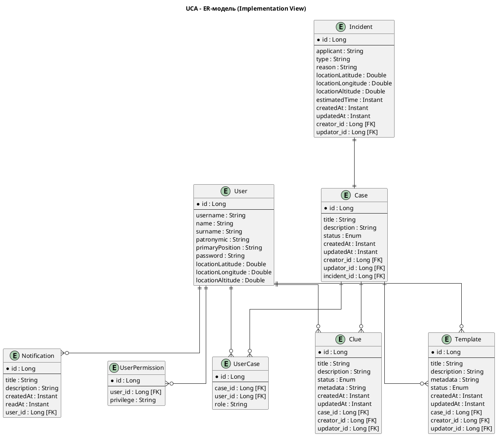

```plantuml-svg
@startuml
title UCA - ER-модель (Implementation View)
skinparam linetype ortho
skinparam nodesep 110
skinparam ranksep 110

entity User {
  *id : Long
  --
  username : String
  name : String
  surname : String
  patronymic : String
  primaryPosition : String
  password : String
  locationLatitude : Double
  locationLongitude : Double
  locationAltitude : Double
}

entity UserPermission {
  *id : Long
  --
  user_id : Long [FK]
  privilege : String
}

entity Case {
  *id : Long
  --
  title : String
  description : String
  status : Enum
  createdAt : Instant
  updatedAt : Instant
  creator_id : Long [FK]
  updator_id : Long [FK]
  incident_id : Long [FK]
}

entity UserCase {
  *id : Long
  --
  case_id : Long [FK]
  user_id : Long [FK]
  role : String
}

entity Incident {
  *id : Long
  --
  applicant : String
  type : String
  reason : String
  locationLatitude : Double
  locationLongitude : Double
  locationAltitude : Double
  estimatedTime : Instant
  createdAt : Instant
  updatedAt : Instant
  creator_id : Long [FK]
  updator_id : Long [FK]
}

entity Clue {
  *id : Long
  --
  title : String
  description : String
  status : Enum
  metadata : String
  createdAt : Instant
  updatedAt : Instant
  case_id : Long [FK]
  creator_id : Long [FK]
  updator_id : Long [FK]
}

entity Template {
  *id : Long
  --
  title : String
  description : String
  metadata : String
  status : Enum
  createdAt : Instant
  updatedAt : Instant
  case_id : Long [FK]
  creator_id : Long [FK]
  updator_id : Long [FK]
}

entity Notification {
  *id : Long
  --
  title : String
  description : String
  createdAt : Instant
  readAt : Instant
  user_id : Long [FK]
}

' связи
User ||--o{ UserPermission
User ||--o{ UserCase
Case ||--o{ UserCase
Incident ||--|| Case
Case ||--o{ Clue
Case ||--o{ Template
User ||--o{ Clue
User ||--o{ Template
User ||--o{ Notification
@enduml

```