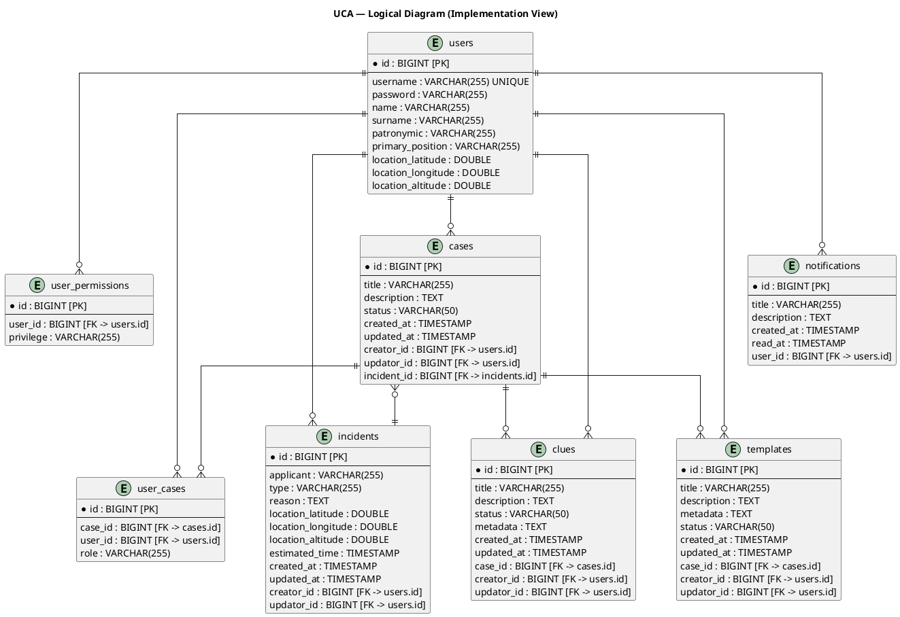

```plantuml-svg
@startuml
title UCA — Logical Diagram (Implementation View)
skinparam linetype ortho
skinparam nodesep 60
skinparam ranksep 60


entity users {
  *id : BIGINT [PK]
  --
  username : VARCHAR(255) UNIQUE
  password : VARCHAR(255)
  name : VARCHAR(255)
  surname : VARCHAR(255)
  patronymic : VARCHAR(255)
  primary_position : VARCHAR(255)
  location_latitude : DOUBLE
  location_longitude : DOUBLE
  location_altitude : DOUBLE
}

entity user_permissions {
  *id : BIGINT [PK]
  --
  user_id : BIGINT [FK -> users.id]
  privilege : VARCHAR(255)
}

entity cases {
  *id : BIGINT [PK]
  --
  title : VARCHAR(255)
  description : TEXT
  status : VARCHAR(50)
  created_at : TIMESTAMP
  updated_at : TIMESTAMP
  creator_id : BIGINT [FK -> users.id]
  updator_id : BIGINT [FK -> users.id]
  incident_id : BIGINT [FK -> incidents.id]
}

entity user_cases {
  *id : BIGINT [PK]
  --
  case_id : BIGINT [FK -> cases.id]
  user_id : BIGINT [FK -> users.id]
  role : VARCHAR(255)
}

entity incidents {
  *id : BIGINT [PK]
  --
  applicant : VARCHAR(255)
  type : VARCHAR(255)
  reason : TEXT
  location_latitude : DOUBLE
  location_longitude : DOUBLE
  location_altitude : DOUBLE
  estimated_time : TIMESTAMP
  created_at : TIMESTAMP
  updated_at : TIMESTAMP
  creator_id : BIGINT [FK -> users.id]
  updator_id : BIGINT [FK -> users.id]
}

entity clues {
  *id : BIGINT [PK]
  --
  title : VARCHAR(255)
  description : TEXT
  status : VARCHAR(50)
  metadata : TEXT
  created_at : TIMESTAMP
  updated_at : TIMESTAMP
  case_id : BIGINT [FK -> cases.id]
  creator_id : BIGINT [FK -> users.id]
  updator_id : BIGINT [FK -> users.id]
}

entity templates {
  *id : BIGINT [PK]
  --
  title : VARCHAR(255)
  description : TEXT
  metadata : TEXT
  status : VARCHAR(50)
  created_at : TIMESTAMP
  updated_at : TIMESTAMP
  case_id : BIGINT [FK -> cases.id]
  creator_id : BIGINT [FK -> users.id]
  updator_id : BIGINT [FK -> users.id]
}

entity notifications {
  *id : BIGINT [PK]
  --
  title : VARCHAR(255)
  description : TEXT
  created_at : TIMESTAMP
  read_at : TIMESTAMP
  user_id : BIGINT [FK -> users.id]
}

users ||--o{ user_permissions
users ||--o{ user_cases
users ||--o{ notifications

cases ||--o{ user_cases
cases ||--o{ clues
cases ||--o{ templates
cases }o--|| incidents

users ||--o{ cases
users ||--o{ clues
users ||--o{ templates
users ||--o{ incidents


@enduml

```