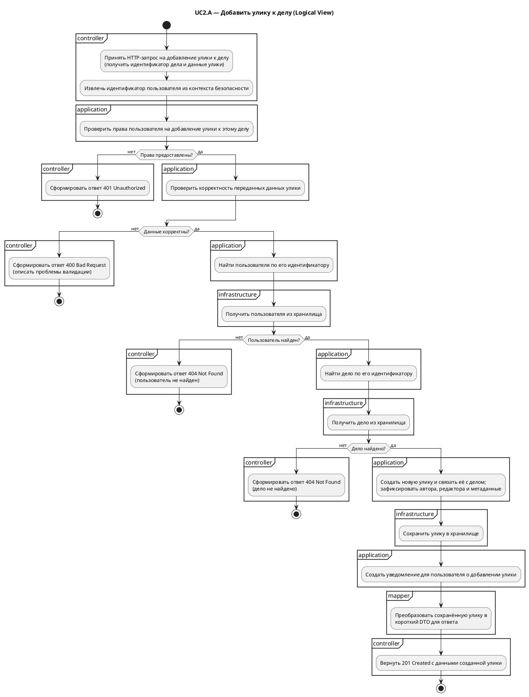
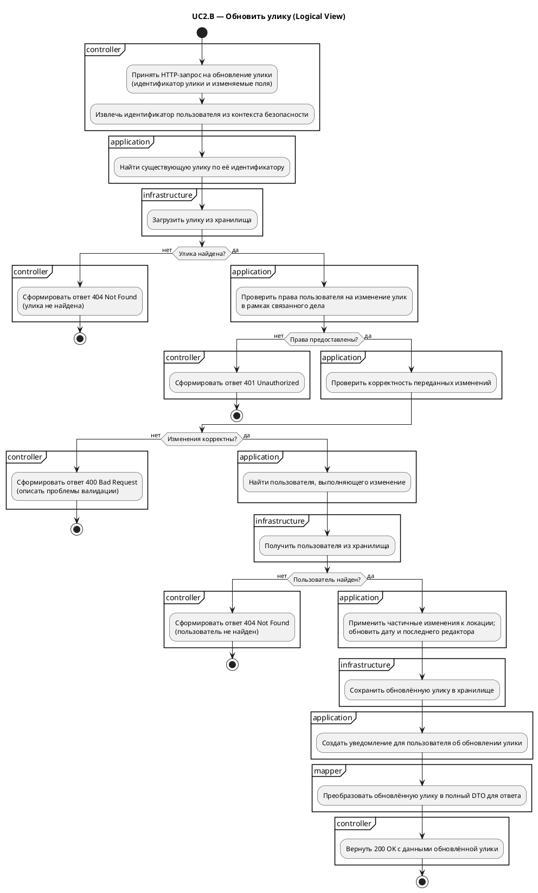

```plantuml-svg
@startuml
title UC2.A — Добавить улику к делу (Logical View)

start

partition "controller" {
  :Принять HTTP-запрос на добавление улики к делу\n(получить идентификатор дела и данные улики);
  :Извлечь идентификатор пользователя из контекста безопасности;
}

partition "application" {
  :Проверить права пользователя на добавление улики к этому делу;
}

if (Права предоставлены?) then (нет)
  partition "controller" {
    :Сформировать ответ 401 Unauthorized;
  }
  stop
else (да)
  partition "application" {
    :Проверить корректность переданных данных улики;
  }
endif

if (Данные корректны?) then (нет)
  partition "controller" {
    :Сформировать ответ 400 Bad Request\n(описать проблемы валидации);
  }
  stop
else (да)
  partition "application" {
    :Найти пользователя по его идентификатору;
  }
  partition "infrastructure" {
    :Получить пользователя из хранилища;
  }

  if (Пользователь найден?) then (нет)
    partition "controller" {
      :Сформировать ответ 404 Not Found\n(пользователь не найден);
    }
    stop
  else (да)
    partition "application" {
      :Найти дело по его идентификатору;
    }
    partition "infrastructure" {
      :Получить дело из хранилища;
    }

    if (Дело найдено?) then (нет)
      partition "controller" {
        :Сформировать ответ 404 Not Found\n(дело не найдено);
      }
      stop
    else (да)
      partition "application" {
        :Создать новую улику и связать её с делом;\nзафиксировать автора, редактора и метаданные;
      }
      partition "infrastructure" {
        :Сохранить улику в хранилище;
      }
      partition "application" {
        :Создать уведомление для пользователя о добавлении улики;
      }
      partition "mapper" {
        :Преобразовать сохранённую улику в\nкороткий DTO для ответа;
      }
      partition "controller" {
        :Вернуть 201 Created с данными созданной улики;
      }
      stop
    endif
  endif
endif
@enduml

```

```plantuml-svg
@startuml
title UC2.B — Обновить улику (Logical View)

start

partition "controller" {
  :Принять HTTP-запрос на обновление улики\n(идентификатор улики и изменяемые поля);
  :Извлечь идентификатор пользователя из контекста безопасности;
}

partition "application" {
  :Найти существующую улику по её идентификатору;
}

partition "infrastructure" {
  :Загрузить улику из хранилища;
}

if (Улика найдена?) then (нет)
  partition "controller" {
    :Сформировать ответ 404 Not Found\n(улика не найдена);
  }
  stop
else (да)
  partition "application" {
    :Проверить права пользователя на изменение улик\nв рамках связанного дела;
  }

  if (Права предоставлены?) then (нет)
    partition "controller" {
      :Сформировать ответ 401 Unauthorized;
    }
    stop
  else (да)
    partition "application" {
      :Проверить корректность переданных изменений;
    }
  endif
endif

if (Изменения корректны?) then (нет)
  partition "controller" {
    :Сформировать ответ 400 Bad Request\n(описать проблемы валидации);
  }
  stop
else (да)
  partition "application" {
    :Найти пользователя, выполняющего изменение;
  }
  partition "infrastructure" {
    :Получить пользователя из хранилища;
  }

  if (Пользователь найден?) then (нет)
    partition "controller" {
      :Сформировать ответ 404 Not Found\n(пользователь не найден);
    }
    stop
  else (да)
    partition "application" {
      :Применить частичные изменения к локации;\nобновить дату и последнего редактора;
    }
    partition "infrastructure" {
      :Сохранить обновлённую улику в хранилище;
    }
    partition "application" {
      :Создать уведомление для пользователя об обновлении улики;
    }
    partition "mapper" {
      :Преобразовать обновлённую улику в полный DTO для ответа;
    }
    partition "controller" {
      :Вернуть 200 OK с данными обновлённой улики;
    }
    stop
  endif
endif
@enduml

```