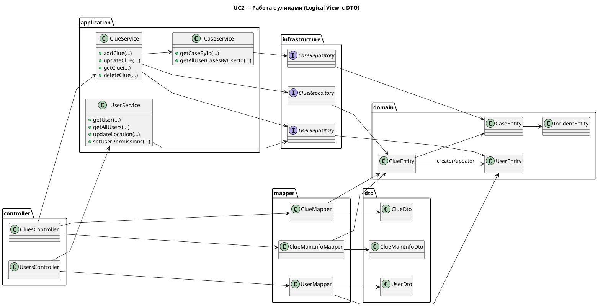

```plantuml
@startuml
left to right direction
skinparam actorStyle awesome
skinparam linetype polyline
skinparam nodesep 50
skinparam ranksep 50
skinparam usecase {
  BorderColor #666
  BackgroundColor #EFEFEF
}
title UC2 — Работа с уликами (Logical View, с DTO)

package "controller" {
  class CluesController
  class UsersController
}

package "application" {
  class ClueService {
    +addClue(...)
    +updateClue(...)
    +getClue(...)
    +deleteClue(...)
  }
  class CaseService {
    +getCaseById(...)
    +getAllUserCasesByUserId(...)
  }
  class UserService {
    +getUser(...)
    +getAllUsers(...)
    +updateLocation(...)
    +setUserPermissions(...)
  }
}

package "infrastructure" {
  interface ClueRepository
  interface UserRepository
  interface CaseRepository
}

package "domain" {
  class ClueEntity
  class CaseEntity
  class UserEntity
  class IncidentEntity
}

package "dto" {
  class ClueDto
  class ClueMainInfoDto
  class UserDto
}

package "mapper" {
  class ClueMapper
  class ClueMainInfoMapper
  class UserMapper
}

CluesController --> ClueService
UsersController --> UserService
CluesController --> ClueMapper
CluesController --> ClueMainInfoMapper
UsersController --> UserMapper

ClueService --> ClueRepository
ClueService --> UserRepository
ClueService --> CaseService
CaseService --> CaseRepository
UserService --> UserRepository

ClueRepository --> ClueEntity
CaseRepository --> CaseEntity
UserRepository --> UserEntity

ClueEntity --> UserEntity : creator/updator
ClueEntity --> CaseEntity
CaseEntity --> IncidentEntity

ClueMapper --> ClueDto
ClueMapper --> ClueEntity
ClueMainInfoMapper --> ClueMainInfoDto
ClueMainInfoMapper --> ClueEntity
UserMapper --> UserDto
UserMapper --> UserEntity
@enduml

```