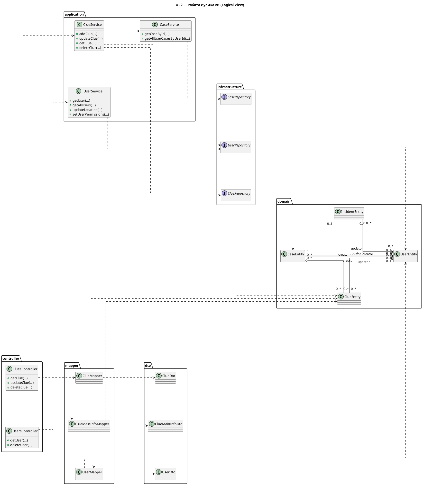

```plantuml-svg
@startuml
left to right direction
skinparam actorStyle awesome
skinparam linetype ortho
skinparam nodesep 150
skinparam ranksep 120

title UC2 — Работа с уликами (Logical View)

package "controller" {
  class CluesController {
    +getClue(...)
    +updateClue(...)
    +deleteClue(...)
  }
  class UsersController {
    +getUser(...)
    +deleteUser(...)
  }
}

package "application" {
  class ClueService {
    +addClue(...)
    +updateClue(...)
    +getClue(...)
    +deleteClue(...)
  }
  class CaseService {
    +getCaseById(...)
    +getAllUserCasesByUserId(...)
  }
  class UserService {
    +getUser(...)
    +getAllUsers(...)
    +updateLocation(...)
    +setUserPermissions(...)
  }
}

package "infrastructure" {
  interface ClueRepository
  interface UserRepository
  interface CaseRepository
}

package "domain" {
  class ClueEntity
  class CaseEntity
  class UserEntity
  class IncidentEntity
}

package "dto" {
  class ClueDto
  class ClueMainInfoDto
  class UserDto
}

package "mapper" {
  class ClueMapper
  class ClueMainInfoMapper
  class UserMapper
}

CaseEntity "1" o-- "0..*" ClueEntity
ClueEntity "0..*" --> "0..1" UserEntity : creator
ClueEntity "0..*" --> "0..1" UserEntity : updator
CaseEntity "0..*" --> "0..1" UserEntity : creator
CaseEntity "0..*" --> "0..1" UserEntity : updator
IncidentEntity "0..*" --> "0..1" UserEntity : creator
IncidentEntity "0..*" --> "0..1" UserEntity : updator
CaseEntity "1" -- "0..1" IncidentEntity

CluesController ..> ClueService
UsersController ..> UserService
CluesController ..> ClueMapper
CluesController ..> ClueMainInfoMapper
UsersController ..> UserMapper

ClueService ..> ClueRepository
ClueService ..> UserRepository
ClueService ..> CaseService
CaseService ..> CaseRepository
UserService ..> UserRepository

ClueRepository ..> ClueEntity
CaseRepository ..> CaseEntity
UserRepository ..> UserEntity

ClueMapper ..> ClueDto
ClueMapper ..> ClueEntity
ClueMainInfoMapper ..> ClueMainInfoDto
ClueMainInfoMapper ..> ClueEntity
UserMapper ..> UserDto
UserMapper ..> UserEntity
@enduml

```