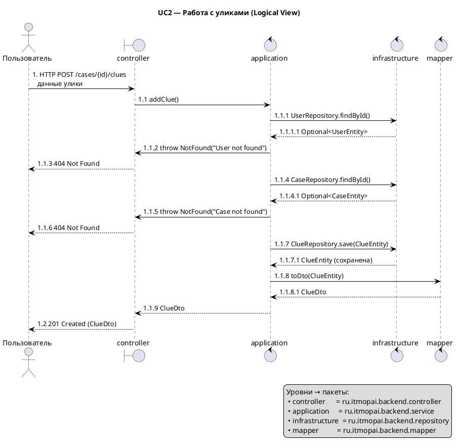

```plantuml-svg
@startuml
title UC2 — Работа с уликами (Logical View)

skinparam linetype ortho
skinparam nodesep 60
skinparam ranksep 60

actor Пользователь as U
boundary "controller" as CTRL
control  "application"    as APP
control  "infrastructure" as INFRA
control  "mapper"          as MAP

U    -[#black]> CTRL : 1. HTTP POST /cases/{id}/clues\n   данные улики
CTRL -[#black]> APP  : 1.1 addClue()

APP  -[#black]> INFRA: 1.1.1 UserRepository.findById()
INFRA-[#black]--> APP : 1.1.1.1 Optional<UserEntity>

APP  -[#black]> CTRL : 1.1.2 throw NotFound("User not found")
CTRL -[#black]--> U  : 1.1.3 404 Not Found

APP  -[#black]> INFRA: 1.1.4 CaseRepository.findById()
INFRA-[#black]--> APP : 1.1.4.1 Optional<CaseEntity>

APP  -[#black]> CTRL : 1.1.5 throw NotFound("Case not found")
CTRL -[#black]--> U  : 1.1.6 404 Not Found

APP  -[#black]> INFRA: 1.1.7 ClueRepository.save(ClueEntity)
INFRA-[#black]--> APP : 1.1.7.1 ClueEntity (сохранена)

APP  -[#black]> MAP : 1.1.8 toDto(ClueEntity)
MAP  -[#black]--> APP: 1.1.8.1 ClueDto

APP  -[#black]--> CTRL: 1.1.9 ClueDto
CTRL -[#black]--> U  : 1.2 201 Created (ClueDto)

legend right
  Уровни → пакеты:
   • controller      = ru.itmopai.backend.controller
   • application     = ru.itmopai.backend.service
   • infrastructure  = ru.itmopai.backend.repository
   • mapper          = ru.itmopai.backend.mapper
endlegend
@enduml

```