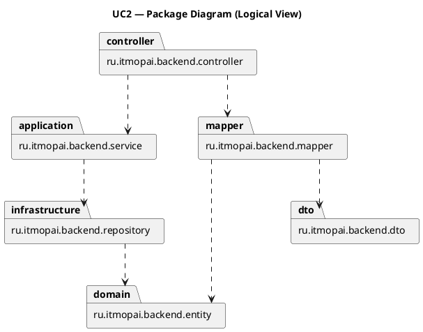

```plantuml-svg
@startuml
title UC2 — Package Diagram (Logical View)
skinparam linetype ortho
skinparam nodesep 60
skinparam ranksep 60


package "ru.itmopai.backend.controller" as controller
package "ru.itmopai.backend.service"    as application
package "ru.itmopai.backend.repository" as infrastructure
package "ru.itmopai.backend.entity"     as domain
package "ru.itmopai.backend.dto"        as dto
package "ru.itmopai.backend.mapper"     as mapper

controller ..> application
controller ..> mapper
application ..> infrastructure
mapper ..> domain
mapper ..> dto
infrastructure ..> domain

@enduml

```