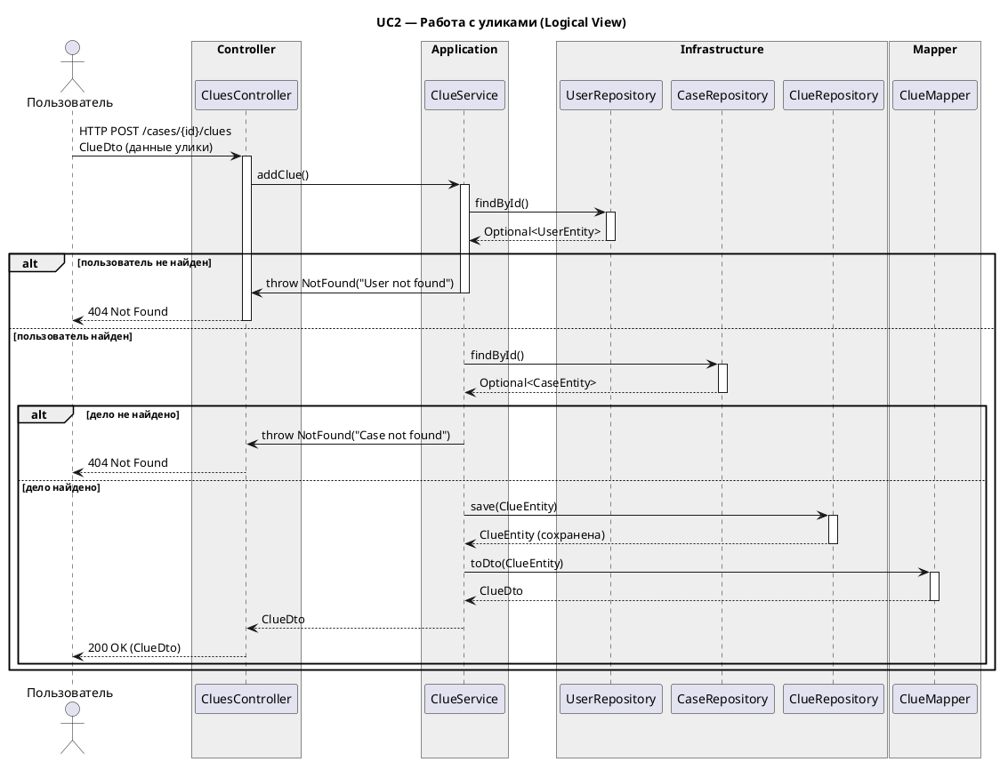

```plantuml-svg
@startuml
title UC2 — Работа с уликами (Logical View)

actor Пользователь as U

box "Controller" #EEEEEE
  participant CluesController as C
end box

box "Application" #EEEEEE
  participant ClueService as S
end box

box "Infrastructure" #EEEEEE
  participant UserRepository as UR
  participant CaseRepository as CR
  participant ClueRepository as CLR
end box

box "Mapper" #EEEEEE
  participant ClueMapper as M
end box

U -> C : HTTP POST /cases/{id}/clues\nClueDto (данные улики)
activate C
C -> S : addClue()
activate S

S -> UR : findById()
activate UR
UR --> S : Optional<UserEntity>
deactivate UR

alt пользователь не найден
  S -> C : throw NotFound("User not found")
  deactivate S
  C --> U : 404 Not Found
  deactivate C
else пользователь найден
  S -> CR : findById()
  activate CR
  CR --> S : Optional<CaseEntity>
  deactivate CR

  alt дело не найдено
    S -> C : throw NotFound("Case not found")
    deactivate S
    C --> U : 404 Not Found
    deactivate C
  else дело найдено
    S -> CLR : save(ClueEntity)
    activate CLR
    CLR --> S : ClueEntity (сохранена)
    deactivate CLR

    S -> M : toDto(ClueEntity)
    activate M
    M --> S : ClueDto
    deactivate M

    S --> C : ClueDto
    deactivate S
    C --> U : 200 OK (ClueDto)
    deactivate C
  end
end

@enduml

```