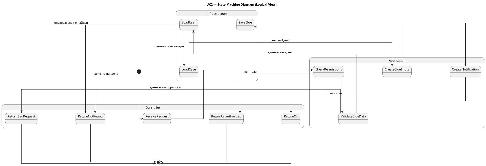

```plantuml-svg
@startuml
title UC2 — State Machine Diagram (Logical View)

top to bottom direction
skinparam linetype ortho
skinparam nodesep 170
skinparam ranksep 160

[*] --> Controller.ReceiveRequest

state "Controller" as Controller {
  state ReceiveRequest
  state ReturnUnauthorized
  state ReturnBadRequest
  state ReturnNotFound
  state ReturnOk
}

state "Application" as Application {
  state CheckPermissions
  state ValidateClueData
  state CreateClueEntity
  state CreateNotification
}

state "Infrastructure" as Infrastructure {
  state LoadUser
  state LoadCase
  state SaveClue
}

Controller.ReceiveRequest --> Application.CheckPermissions

Application.CheckPermissions --> Controller.ReturnUnauthorized : нет прав
Application.CheckPermissions --> Application.ValidateClueData  : права есть

Application.ValidateClueData --> Controller.ReturnBadRequest : данные некорректны
Application.ValidateClueData --> Infrastructure.LoadUser     : данные валидны

Infrastructure.LoadUser --> Controller.ReturnNotFound : пользователь не найден
Infrastructure.LoadUser --> Infrastructure.LoadCase   : пользователь найден

Infrastructure.LoadCase --> Controller.ReturnNotFound : дело не найдено
Infrastructure.LoadCase --> Application.CreateClueEntity : дело найдено

Application.CreateClueEntity --> Infrastructure.SaveClue
Infrastructure.SaveClue --> Application.CreateNotification
Application.CreateNotification --> Controller.ReturnOk

Controller.ReturnUnauthorized --> [*]
Controller.ReturnBadRequest   --> [*]
Controller.ReturnNotFound     --> [*]
Controller.ReturnOk           --> [*]

@enduml

```