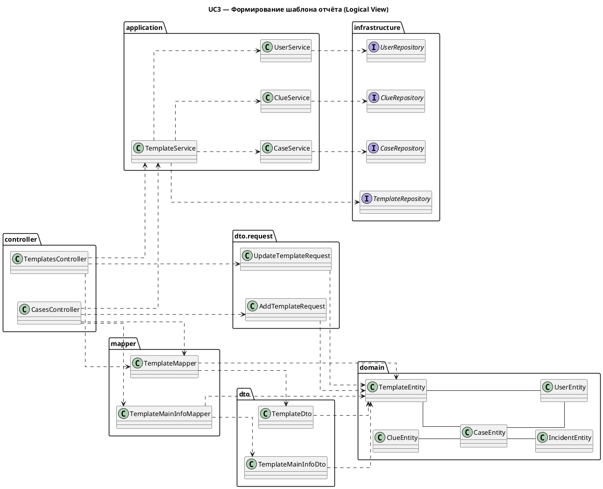

```plantuml
@startuml
title UC3 — Формирование шаблона отчёта (Logical View)
left to right direction
skinparam linetype ortho
skinparam nodesep 60
skinparam ranksep 60

package "controller" {
  class CasesController
  class TemplatesController
}

package "application" {
  class TemplateService
  class CaseService
  class ClueService
  class UserService
}

package "infrastructure" {
  interface TemplateRepository
  interface CaseRepository
  interface ClueRepository
  interface UserRepository
}

package "domain" {
  class TemplateEntity
  class CaseEntity
  class ClueEntity
  class UserEntity
  class IncidentEntity
}

package "dto" {
  class TemplateDto
  class TemplateMainInfoDto
}

package "dto.request" as request {
  class AddTemplateRequest
  class UpdateTemplateRequest
}

package "mapper" {
  class TemplateMapper
  class TemplateMainInfoMapper
}

CasesController ..> TemplateService
CasesController ..> TemplateMapper
CasesController ..> TemplateMainInfoMapper
CasesController ..> AddTemplateRequest

TemplatesController ..> TemplateService
TemplatesController ..> TemplateMapper
TemplatesController ..> UpdateTemplateRequest

TemplateService ..> TemplateRepository
TemplateService ..> CaseService
TemplateService ..> ClueService
TemplateService ..> UserService

CaseService ..> CaseRepository
ClueService ..> ClueRepository
UserService ..> UserRepository

TemplateMapper ..> TemplateDto
TemplateMapper ..> TemplateEntity
TemplateMainInfoMapper ..> TemplateMainInfoDto
TemplateMainInfoMapper ..> TemplateEntity

TemplateDto ..> TemplateEntity
TemplateMainInfoDto ..> TemplateEntity
AddTemplateRequest ..> TemplateEntity
UpdateTemplateRequest ..> TemplateEntity

TemplateEntity -- CaseEntity
TemplateEntity -- UserEntity
ClueEntity -- CaseEntity
CaseEntity -- IncidentEntity
CaseEntity -- UserEntity
@enduml

```