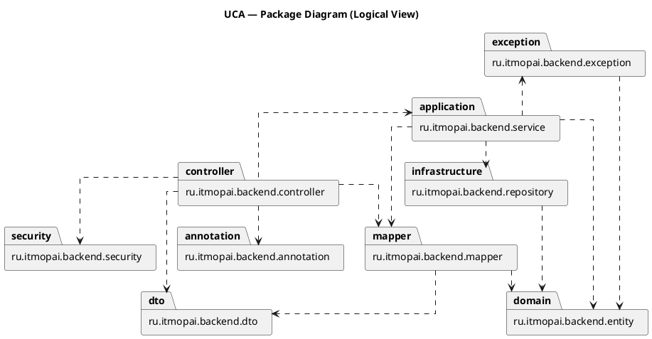

```plantuml-svg
@startuml
title UCA — Package Diagram (Logical View)
skinparam linetype ortho
skinparam nodesep 30
skinparam ranksep 30

package "ru.itmopai.backend.controller" as controller
package "ru.itmopai.backend.service"    as application
package "ru.itmopai.backend.repository" as infrastructure
package "ru.itmopai.backend.entity"     as domain
package "ru.itmopai.backend.dto"        as dto
package "ru.itmopai.backend.mapper"     as mapper
package "ru.itmopai.backend.exception"  as exception
package "ru.itmopai.backend.security"   as security
package "ru.itmopai.backend.annotation" as annotation

controller .up.> application
controller ..> mapper
controller ..> dto
controller ..> annotation
controller ..> security

application ..> infrastructure
application ..> mapper
application ..> domain
application .up.> exception

mapper ..> domain
mapper ..> dto

infrastructure ..> domain

exception ..> domain
@enduml

```