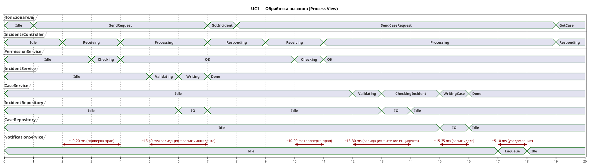

```plantuml-svg
@startuml
title UC1 — Обработка вызовов (Process View)

' Масштаб времени (условный)
scale 1 as 100 pixels

' Участники/треки
concise "Пользователь" as U
concise "IncidentsController" as CTRL
concise "PermissionService" as AUTH
concise "IncidentService" as IS
concise "CaseService" as CS
concise "IncidentRepository" as IR
concise "CaseRepository" as CR
concise "NotificationService" as NTF

@0
U is Idle
CTRL is Idle
AUTH is Idle
IS is Idle
CS is Idle
IR is Idle
CR is Idle
NTF is Idle

@1
U is SendRequest
@2
CTRL is Receiving

@3
AUTH is Checking
@4
AUTH is OK
CTRL is Processing

@5
IS is Validating
@6
IS is Writing
IR is IO
@7
IR is Idle
IS is Done
CTRL is Responding
U is GotIncident

@8
U is SendCaseRequest
@9
CTRL is Receiving

@10
AUTH is Checking
@11
AUTH is OK
CTRL is Processing

@12
CS is Validating
@13
CS is CheckingIncident
IR is IO
@14
IR is Idle

@15
CS is WritingCase
CR is IO
@16
CR is Idle
CS is Done

@17
NTF is Enqueue
@18
NTF is Idle

@19
CTRL is Responding
U is GotCase

@2 <-> @4 : ~10–20 ms (проверка прав)
@5 <-> @7 : ~15–40 ms (валидация + запись инцидента)
@10 <-> @11 : ~10–20 ms (проверка прав)
@12 <-> @14 : ~15–30 ms (валидация + чтение инцидента)
@15 <-> @16 : ~15–35 ms (запись дела)
@17 <-> @18 : ~5–10 ms (уведомление)

@enduml

```