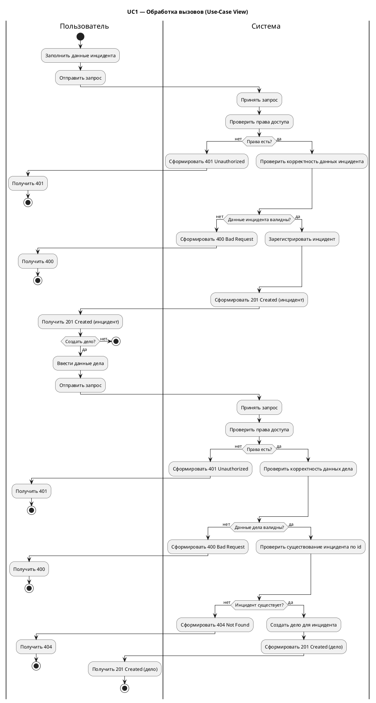

```plantuml-svg
@startuml
title UC1 — Обработка вызовов (Use-Case View)

|Пользователь|
start
:Заполнить данные инцидента;
:Отправить запрос;

|Система|
:Принять запрос;
:Проверить права доступа;

if (Права есть?) then (нет)
  :Сформировать 401 Unauthorized;
  |Пользователь|
  :Получить 401;
  stop
else (да)
  |Система|
  :Проверить корректность данных инцидента;
endif

|Система|
if (Данные инцидента валидны?) then (нет)
  :Сформировать 400 Bad Request;
  |Пользователь|
  :Получить 400;
  stop
else (да)
  |Система|
  :Зарегистрировать инцидент;
endif

|Система|
  :Сформировать 201 Created (инцидент);
  |Пользователь|
  :Получить 201 Created (инцидент);
if (Создать дело?) then (нет)
  stop
else (да)
  |Пользователь|
  :Ввести данные дела;
  :Отправить запрос;
endif

|Система|
:Принять запрос;
:Проверить права доступа;

if (Права есть?) then (нет)
  :Сформировать 401 Unauthorized;
  |Пользователь|
  :Получить 401;
  stop
else (да)
  |Система|
  :Проверить корректность данных дела;
endif

|Система|
if (Данные дела валидны?) then (нет)
  :Сформировать 400 Bad Request;
  |Пользователь|
  :Получить 400;
  stop
else (да)
  |Система|
  :Проверить существование инцидента по id;
endif

|Система|
if (Инцидент существует?) then (нет)
  :Сформировать 404 Not Found;
  |Пользователь|
  :Получить 404;
  stop
else (да)
  |Система|
  :Создать дело для инцидента;
  :Сформировать 201 Created (дело);
  |Пользователь|
  :Получить 201 Created (дело);
  stop
endif
@enduml

```