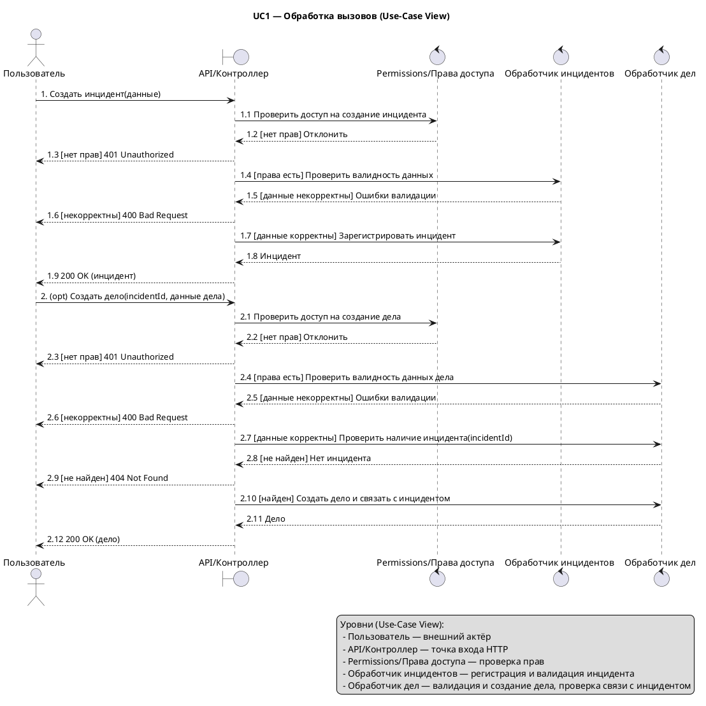

```plantuml-svg
@startuml
title UC1 — Обработка вызовов (Use-Case View)

actor Пользователь as U
boundary "API/Контроллер" as API
control  "Permissions/Права доступа" as AUTH
control  "Обработчик инцидентов" as INCIDENT
control  "Обработчик дел" as CASES

U  -> API      : 1. Создать инцидент(данные)
API -> AUTH    : 1.1 Проверить доступ на создание инцидента
AUTH --> API   : 1.2 [нет прав] Отклонить
API --> U      : 1.3 [нет прав] 401 Unauthorized

API -> INCIDENT: 1.4 [права есть] Проверить валидность данных
INCIDENT --> API: 1.5 [данные некорректны] Ошибки валидации
API --> U       : 1.6 [некорректны] 400 Bad Request

API -> INCIDENT: 1.7 [данные корректны] Зарегистрировать инцидент
INCIDENT --> API: 1.8 Инцидент
API --> U       : 1.9 200 OK (инцидент)

U  -> API      : 2. (opt) Создать дело(incidentId, данные дела)
API -> AUTH    : 2.1 Проверить доступ на создание дела
AUTH --> API   : 2.2 [нет прав] Отклонить
API --> U      : 2.3 [нет прав] 401 Unauthorized

API -> CASES   : 2.4 [права есть] Проверить валидность данных дела
CASES --> API  : 2.5 [данные некорректны] Ошибки валидации
API --> U      : 2.6 [некорректны] 400 Bad Request

API -> CASES   : 2.7 [данные корректны] Проверить наличие инцидента(incidentId)
CASES --> API  : 2.8 [не найден] Нет инцидента
API --> U      : 2.9 [не найден] 404 Not Found

API -> CASES   : 2.10 [найден] Создать дело и связать с инцидентом
CASES --> API  : 2.11 Дело
API --> U      : 2.12 200 OK (дело)

legend right
  Уровни (Use-Case View):
   - Пользователь — внешний актёр
   - API/Контроллер — точка входа HTTP
   - Permissions/Права доступа — проверка прав
   - Обработчик инцидентов — регистрация и валидация инцидента
   - Обработчик дел — валидация и создание дела, проверка связи с инцидентом
endlegend
@enduml

```
