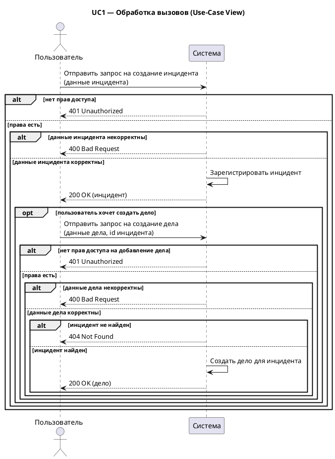

```plantuml-svg
@startuml
title UC1 — Обработка вызовов (Use-Case View)

actor Пользователь as U
participant Система as S

U -> S : Отправить запрос на создание инцидента\n(данные инцидента)

alt нет прав доступа 
  S --> U : 401 Unauthorized
else права есть 
  alt данные инцидента некорректны 
    S --> U : 400 Bad Request
  else данные инцидента корректны 
    S -> S : Зарегистрировать инцидент
    S --> U : 200 OK (инцидент)

    opt пользователь хочет создать дело 
      U -> S : Отправить запрос на создание дела\n(данные дела, id инцидента)

      alt нет прав доступа на добавление дела 
        S --> U : 401 Unauthorized
      else права есть 
        alt данные дела некорректны 
          S --> U : 400 Bad Request
        else данные дела корректны 
          alt инцидент не найден 
            S --> U : 404 Not Found
          else инцидент найден 
            S -> S : Создать дело для инцидента
            S --> U : 200 OK (дело)
          end
        end
      end
    end
  end
end
@enduml

```