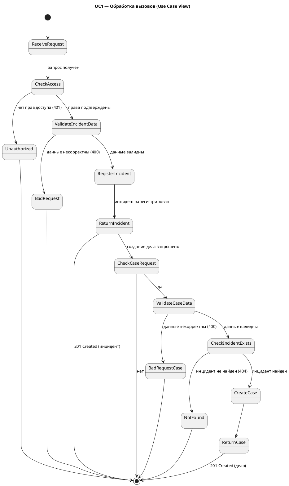

```plantuml-svg
@startuml
title UC1 — Обработка вызовов (Use Case View)

[*] --> ReceiveRequest

state ReceiveRequest
ReceiveRequest --> CheckAccess : запрос получен

state CheckAccess
CheckAccess --> Unauthorized : нет прав доступа (401)
CheckAccess --> ValidateIncidentData : права подтверждены

state Unauthorized
Unauthorized --> [*]

state ValidateIncidentData
ValidateIncidentData --> BadRequest : данные некорректны (400)
ValidateIncidentData --> RegisterIncident : данные валидны

state BadRequest
BadRequest --> [*]

state RegisterIncident
RegisterIncident --> ReturnIncident : инцидент зарегистрирован

state ReturnIncident
ReturnIncident --> [*] : 201 Created (инцидент)
ReturnIncident --> CheckCaseRequest : создание дела запрошено

state CheckCaseRequest
CheckCaseRequest --> ValidateCaseData : да
CheckCaseRequest --> [*] : нет

state ValidateCaseData
ValidateCaseData --> BadRequestCase : данные некорректны (400)
ValidateCaseData --> CheckIncidentExists : данные валидны

state BadRequestCase
BadRequestCase --> [*]

state CheckIncidentExists
CheckIncidentExists --> NotFound : инцидент не найден (404)
CheckIncidentExists --> CreateCase : инцидент найден

state NotFound
NotFound --> [*]

state CreateCase
CreateCase --> ReturnCase

state ReturnCase
ReturnCase --> [*] : 201 Created (дело)
@enduml

```