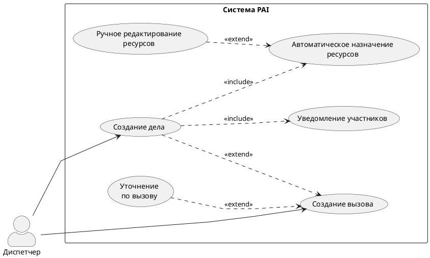

```plantuml-svg
@startuml
left to right direction
skinparam actorStyle awesome
skinparam linetype polyline
skinparam nodesep 60
skinparam ranksep 60

actor "Диспетчер" as Dispatcher

rectangle "Система PAI" {
  usecase "Создание вызова" as UC_CreateCall
  usecase "Создание дела" as UC_CreateCase
  usecase "Автоматическое назначение\nресурсов" as UC_AutoAssign
  usecase "Ручное редактирование\nресурсов" as UC_ManualAssign
  usecase "Уведомление участников" as UC_Notify
  usecase "Уточнение\nпо вызову" as UC_Clarify
}

Dispatcher --> UC_CreateCall
Dispatcher --> UC_CreateCase

' дело — опциональное продолжение вызова
UC_CreateCase ..> UC_CreateCall : <<extend>>

' включаемое поведение при создании дела
UC_CreateCase ..> UC_AutoAssign : <<include>>
UC_CreateCase ..> UC_Notify     : <<include>>

' опциональная коррекция после авто-назначения
UC_ManualAssign ..> UC_AutoAssign : <<extend>>

' ветка "требует уточнения" от создания вызова
UC_Clarify ..> UC_CreateCall : <<extend>>
@enduml

```