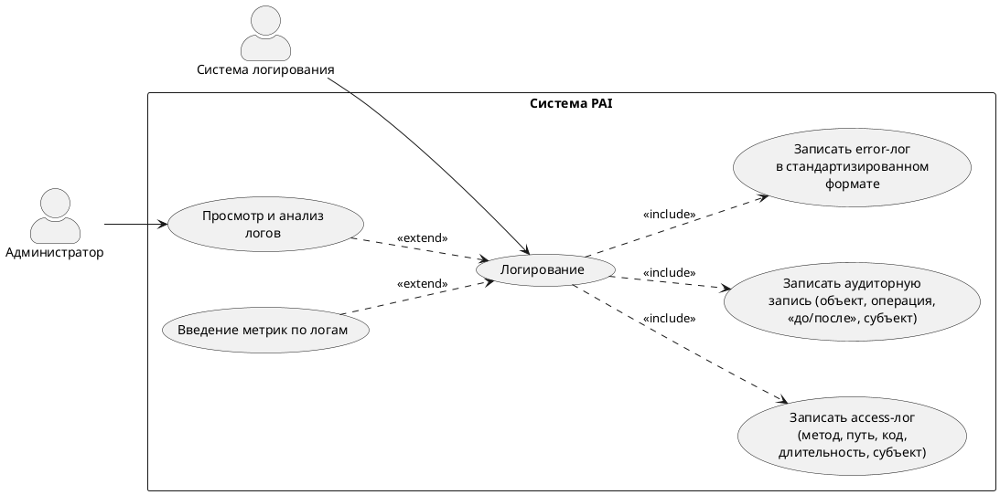

```plantuml-svg
@startuml
left to right direction
skinparam actorStyle awesome
skinparam nodesep 60
skinparam ranksep 60

actor "Система логирования" as LogSys
actor "Администратор" as Admin

rectangle "Система PAI" {
  usecase "Логирование" as UC10

  usecase "Записать access-лог\n(метод, путь, код,\nдлительность, субъект)" as UC10_Access
  usecase "Записать аудиторную\nзапись (объект, операция,\n«до/после», субъект)" as UC10_Audit
  usecase "Записать error-лог\nв стандартизированном\nформате" as UC10_Error
  usecase "Просмотр и анализ\nлогов" as UC10_View

  usecase "Введение метрик по логам" as UC10_Metrics
}

LogSys --> UC10
Admin --> UC10_View

UC10 ..> UC10_Access : <<include>>
UC10 ..> UC10_Audit : <<include>>
UC10 ..> UC10_Error : <<include>>

UC10_Metrics ..> UC10 : <<extend>>
UC10_View ..> UC10 : <<extend>> 

@enduml

```