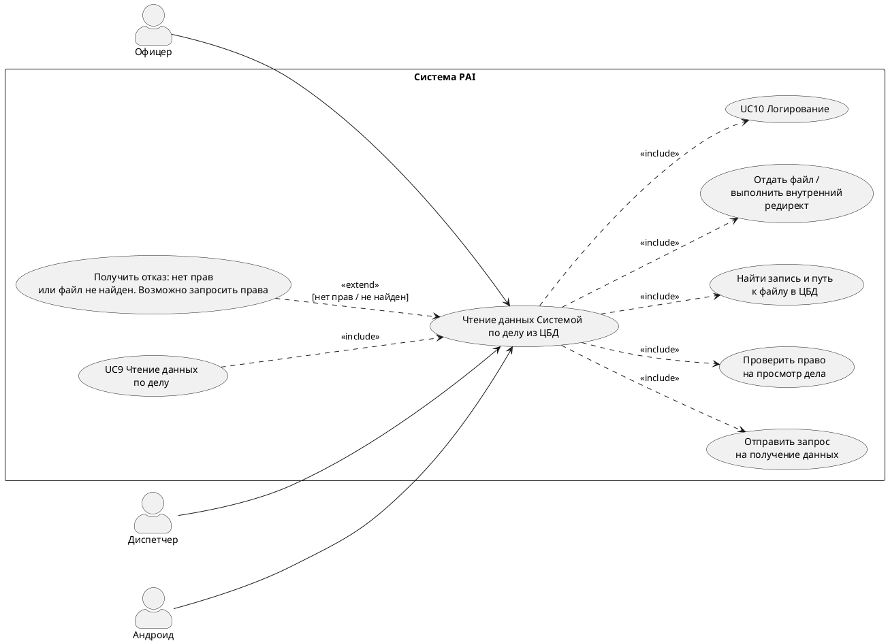

```plantuml-svg
@startuml
left to right direction
skinparam actorStyle awesome
skinparam nodesep 60
skinparam ranksep 60

actor "Офицер" as Officer
actor "Диспетчер" as Dispatcher
actor "Андроид" as Android

rectangle "Система PAI" {
  usecase "Чтение данных Системой\n по делу из ЦБД" as UC11

  usecase "Отправить запрос\nна получение данных" as UC11_Request
  usecase "Проверить право\nна просмотр дела" as UC11_Check
  usecase "Найти запись и путь\nк файлу в ЦБД" as UC11_Locate
  usecase "Отдать файл /\nвыполнить внутренний\nредирект" as UC11_Deliver

  usecase "Получить отказ: нет прав\nили файл не найден. Возможно запросить права" as UC11_Deny

  usecase "UC9 Чтение данных\nпо делу" as UC9
  usecase "UC10 Логирование" as UC10
}

Officer --> UC11
Dispatcher --> UC11
Android --> UC11

UC11 ..> UC11_Request : <<include>>
UC11 ..> UC11_Check : <<include>>
UC11 ..> UC11_Locate : <<include>>
UC11 ..> UC11_Deliver : <<include>>

UC11_Deny ..> UC11 : <<extend>>\n[нет прав / не найден]

UC9 ..> UC11 : <<include>>
UC11 ..> UC10 : <<include>>

@enduml

```