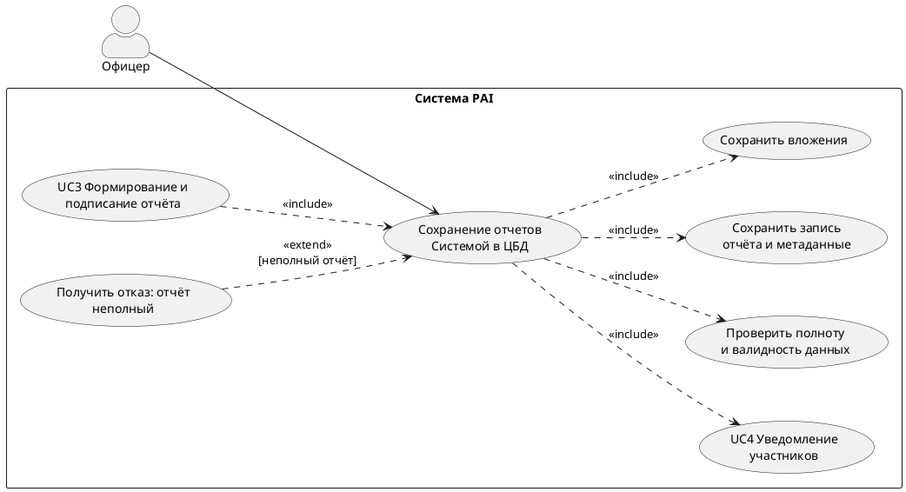

```plantuml-svg
@startuml
left to right direction
skinparam actorStyle awesome
skinparam nodesep 60
skinparam ranksep 60

actor "Офицер" as Officer

rectangle "Система PAI" {
  usecase "Сохранение отчетов\nСистемой в ЦБД" as UC12

  usecase "UC3 Формирование и\nподписание отчёта" as UC3
  usecase "UC4 Уведомление\nучастников" as UC4_Notify

  usecase "Проверить полноту\nи валидность данных" as UC12_Validate
  usecase "Сохранить запись\nотчёта и метаданные" as UC12_SaveMeta
  usecase "Сохранить вложения" as UC12_SaveFiles

  usecase "Получить отказ: отчёт\nнеполный" as UC12_Deny
}

Officer --> UC12

UC3 ..> UC12 : <<include>>
UC12 ..> UC12_Validate : <<include>>
UC12 ..> UC12_SaveMeta : <<include>>
UC12 ..> UC12_SaveFiles : <<include>>

UC12_Deny ..> UC12 : <<extend>>\n[неполный отчёт]

UC12 ..> UC4_Notify : <<include>>

@enduml

```