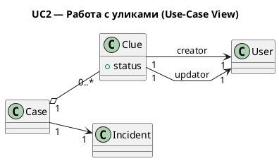

```plantuml
@startuml
left to right direction
skinparam actorStyle awesome
skinparam linetype polyline
skinparam nodesep 60
skinparam ranksep 60
skinparam usecase {
  BorderColor #666
  BackgroundColor #EFEFEF
}

title UC2 — Работа с уликами (Use-Case View)

class Case
class Clue {
  +status
}
class Incident
class User

Case "1" o-- "0..*" Clue
Clue "1" --> "1" User : creator
Clue "1" --> "1" User : updator
Case "1" --> "1" Incident
@enduml

```