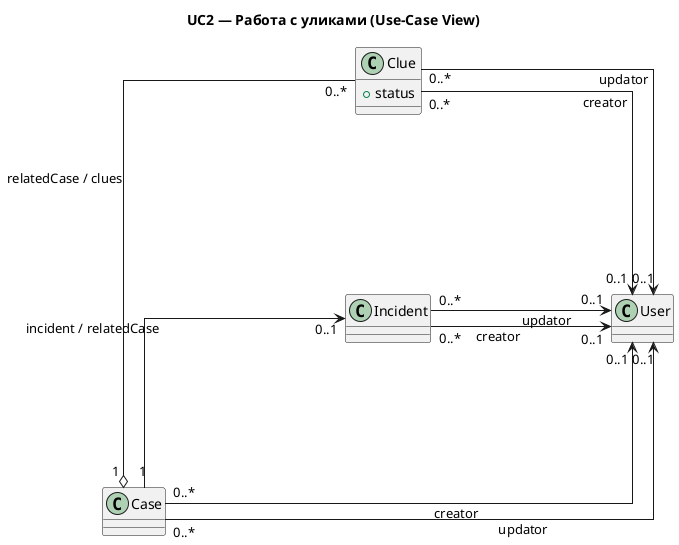

```plantuml
@startuml
left to right direction
skinparam actorStyle awesome
skinparam linetype ortho
skinparam nodesep 180
skinparam ranksep 180

title UC2 — Работа с уликами (Use-Case View)

class Case
class Clue {
  +status
}
class Incident
class User

Case "1" o-- "0..*" Clue : relatedCase / clues
Clue "0..*" --> "0..1" User : creator
Clue "0..*" --> "0..1" User : updator
Case "0..*" --> "0..1" User : creator
Case "0..*" --> "0..1" User : updator
Incident "0..*" --> "0..1" User : creator
Incident "0..*" --> "0..1" User : updator
Case "1" --> "0..1" Incident : incident / relatedCase

@enduml

```