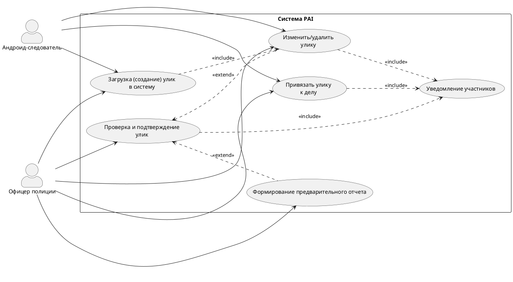

```plantuml-svg
@startuml
left to right direction
skinparam actorStyle awesome
'skinparam linetype polyline
skinparam nodesep 60
skinparam ranksep 60

actor "Андроид-следователь" as AndroidInv
actor "Офицер полиции" as Officer

rectangle "Система PAI" {
  usecase "Изменить/удалить\nулику" as UC_ClueEdit
  usecase "Загрузка (создание) улик\nв систему" as UC_Upload
  usecase "Проверка и подтверждение\nулик" as UC_Verify
  usecase "Привязать улику\nк делу" as UC_ClueLink
  usecase "Уведомление участников" as UC_Notify
  usecase "Формирование предварительного отчета" as UC_Template
}

AndroidInv --> UC_Upload
AndroidInv --> UC_ClueLink
AndroidInv --> UC_ClueEdit

Officer --> UC_Upload
Officer --> UC_Verify
Officer --> UC_ClueEdit
Officer --> UC_ClueLink
Officer --> UC_Template

UC_Upload ..> UC_ClueEdit : <<include>>
UC_Verify ..> UC_Notify : <<include>>
UC_Verify <.. UC_ClueEdit : <<extend>>
UC_Verify <.. UC_Template : <<extend>>
UC_ClueEdit ..> UC_Notify : <<include>>
UC_ClueLink ..> UC_Notify : <<include>>
@enduml

```