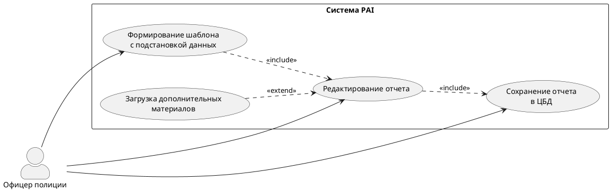

```plantuml-svg
@startuml
left to right direction
skinparam actorStyle awesome
skinparam nodesep 60
skinparam ranksep 60

actor "Офицер полиции" as Officer

rectangle "Система PAI" {
  usecase "Формирование шаблона\nс подстановкой данных" as UC_Generate
  usecase "Редактирование отчета" as UC_Edit
  usecase "Сохранение отчета\nв ЦБД" as UC_Save
  usecase "Загрузка дополнительных\nматериалов" as UC_Extend
}

Officer --> UC_Generate
Officer --> UC_Edit
Officer --> UC_Save

UC_Generate ..> UC_Edit : <<include>>
UC_Edit ..> UC_Save     : <<include>>

UC_Extend ..> UC_Edit : <<extend>>

@enduml

```