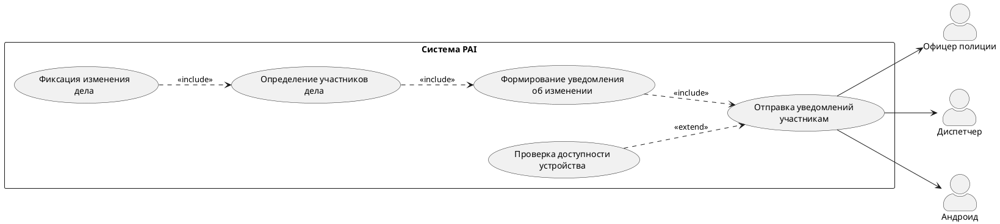

```plantuml-svg
@startuml
left to right direction
skinparam actorStyle awesome
skinparam linetype polyline
skinparam nodesep 60
skinparam ranksep 60

actor "Офицер полиции" as Officer
actor "Диспетчер" as Dispatcher
actor "Андроид" as Android

rectangle "Система PAI" {
  usecase "Фиксация изменения\nдела" as UC_Trigger
  usecase "Определение участников\nдела" as UC_GetParticipants
  usecase "Формирование уведомления\nоб изменении" as UC_GenerateNotify
  usecase "Отправка уведомлений\nучастникам" as UC_SendNotify
  usecase "Проверка доступности\nустройства" as UC_CheckDelivery
}

UC_Trigger ..> UC_GetParticipants : <<include>>
UC_GetParticipants ..> UC_GenerateNotify : <<include>>
UC_GenerateNotify ..> UC_SendNotify      : <<include>>

UC_CheckDelivery ..> UC_SendNotify : <<extend>>

UC_SendNotify --> Officer
UC_SendNotify --> Dispatcher
UC_SendNotify --> Android
@enduml

```