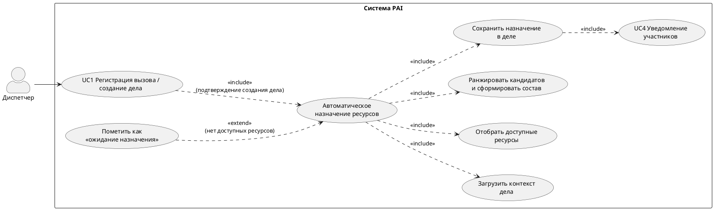

```plantuml-svg
@startuml
left to right direction
skinparam actorStyle awesome
skinparam nodesep 60
skinparam ranksep 60

actor "Диспетчер" as Dispatcher

rectangle "Система PAI" {
  usecase "UC1 Регистрация вызова /\nсоздание дела" as UC1
  usecase "UC4 Уведомление\nучастников" as UC4_Notify

  usecase "Автоматическое\nназначение ресурсов" as UC5

  usecase "Загрузить контекст\nдела" as UC5_LoadCtx
  usecase "Отобрать доступные\nресурсы" as UC5_Select
  usecase "Ранжировать кандидатов\nи сформировать состав" as UC5_Rank
  usecase "Сохранить назначение\nв деле" as UC5_Persist

  usecase "Пометить как\n«ожидание назначения»" as UC5_Wait
}

Dispatcher --> UC1
UC1 ..> UC5 : <<include>>\n(подтверждение создания дела)

UC5 ..> UC5_LoadCtx : <<include>>
UC5 ..> UC5_Select : <<include>>
UC5 ..> UC5_Rank : <<include>>
UC5 ..> UC5_Persist : <<include>>

UC5_Wait ..> UC5 : <<extend>>\n(нет доступных ресурсов)

UC5_Persist ..> UC4_Notify : <<include>>

@enduml

```