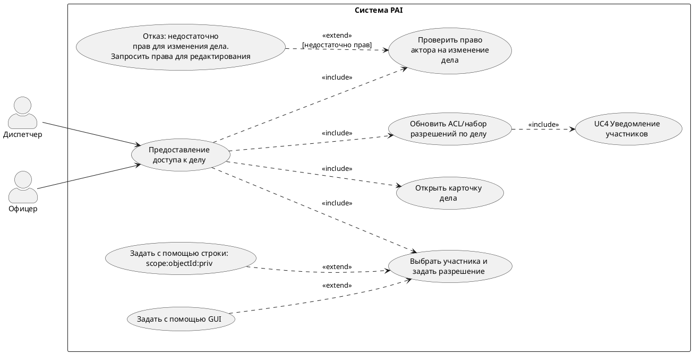

```plantuml-svg
@startuml
left to right direction
skinparam actorStyle awesome
skinparam nodesep 60
skinparam ranksep 60

actor "Диспетчер" as Dispatcher
actor "Офицер" as Officer

rectangle "Система PAI" {
  usecase "Предоставление\nдоступа к делу" as UC6
  usecase "Открыть карточку\nдела" as UC6_OpenCase
  usecase "Выбрать участника и\nзадать разрешение" as UC6_SelectPerm
  usecase "Проверить право\nактора на изменение\nдела" as UC6_CheckRights
  usecase "Обновить ACL/набор\nразрешений по делу" as UC6_UpdateACL
  usecase "Отказ: недостаточно\nправ для изменения дела.\nЗапросить права для редактирования" as UC6_Deny
  usecase "UC4 Уведомление\nучастников" as UC4_Notify
  usecase "Задать с помощью GUI" as UC6_GUI
  usecase "Задать с помощью строки:\nscope:objectId:priv" as UC6_Raw
}

Dispatcher --> UC6
Officer --> UC6

' Основные шаги UC6
UC6 ..> UC6_OpenCase : <<include>>
UC6 ..> UC6_SelectPerm : <<include>>
UC6 ..> UC6_CheckRights : <<include>>
UC6 ..> UC6_UpdateACL : <<include>>
UC6_Deny ..> UC6_CheckRights : <<extend>>\n[недостаточно прав]
UC6_GUI ..> UC6_SelectPerm : <<extend>>
UC6_Raw ..> UC6_SelectPerm : <<extend>>

UC6_UpdateACL ..> UC4_Notify : <<include>>

@enduml

```