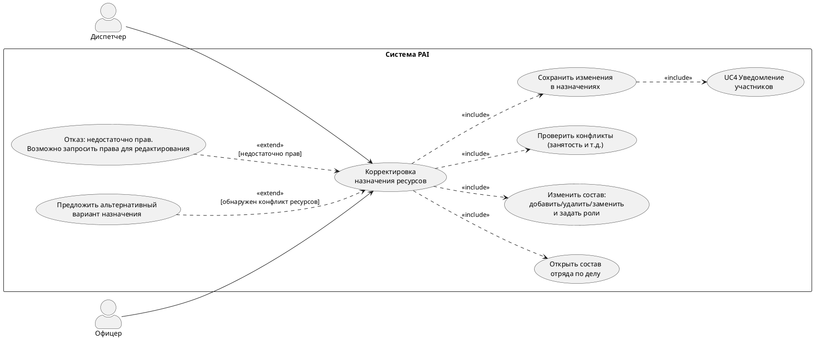

```plantuml-svg
@startuml
left to right direction
skinparam actorStyle awesome
skinparam nodesep 60
skinparam ranksep 60

actor "Диспетчер" as Dispatcher
actor "Офицер" as Officer

rectangle "Система PAI" {
  usecase "Корректировка\nназначения ресурсов" as UC7

  usecase "Открыть состав\nотряда по делу" as UC7_Open
  usecase "Изменить состав:\nдобавить/удалить/заменить\nи задать роли" as UC7_Edit
  usecase "Проверить конфликты\n(занятость и т.д.)" as UC7_Check
  usecase "Сохранить изменения\nв назначениях" as UC7_Save

  usecase "Отказ: недостаточно прав.\nВозможно запросить права для редактирования" as UC7_Deny
  usecase "Предложить альтернативный\nвариант назначения" as UC7_Alt

  usecase "UC4 Уведомление\nучастников" as UC4_Notify
}

Dispatcher --> UC7
Officer --> UC7

UC7 ..> UC7_Open : <<include>>
UC7 ..> UC7_Edit : <<include>>
UC7 ..> UC7_Check : <<include>>
UC7 ..> UC7_Save : <<include>>

UC7_Deny ..> UC7 : <<extend>>\n[недостаточно прав]
UC7_Alt ..> UC7 : <<extend>>\n[обнаружен конфликт ресурсов]

UC7_Save ..> UC4_Notify : <<include>>

@enduml

```