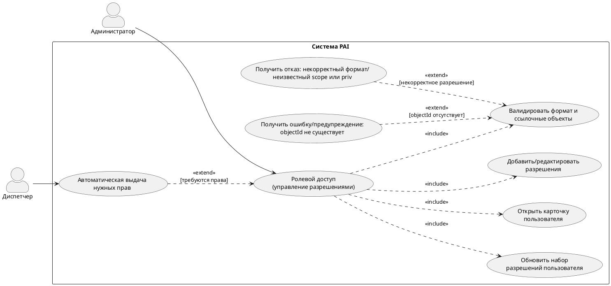

```plantuml-svg
@startuml
left to right direction
skinparam actorStyle awesome
skinparam nodesep 60
skinparam ranksep 60

actor "Администратор" as Admin
actor "Диспетчер" as Dispatcher

rectangle "Система PAI" {
  usecase "Ролевой доступ\n(управление разрешениями)" as UC8

  usecase "Открыть карточку\nпользователя" as UC8_OpenUser
  usecase "Добавить/редактировать\nразрешения" as UC8_EditPerms
  usecase "Валидировать формат и\nссылочные объекты" as UC8_Validate
  usecase "Обновить набор\nразрешений пользователя" as UC8_Update

  usecase "Получить отказ: некорректный формат/\nнеизвестный scope или priv" as UC8_DenyInvalid
  usecase "Получить ошибку/предупреждение:\nobjectId не существует" as UC8_ObjectIssue

  usecase "Автоматическая выдача\nнужных прав" as UC8_AutoGrant
}

Admin --> UC8
Dispatcher --> UC8_AutoGrant

UC8 ..> UC8_OpenUser : <<include>>
UC8 ..> UC8_EditPerms : <<include>>
UC8 ..> UC8_Validate : <<include>>
UC8 ..> UC8_Update : <<include>>

UC8_DenyInvalid ..> UC8_Validate : <<extend>>\n[некорректное разрешение]
UC8_ObjectIssue ..> UC8_Validate : <<extend>>\n[objectId отсутствует]

UC8_AutoGrant ..> UC8 : <<extend>>\n[требуются права]

@enduml

```