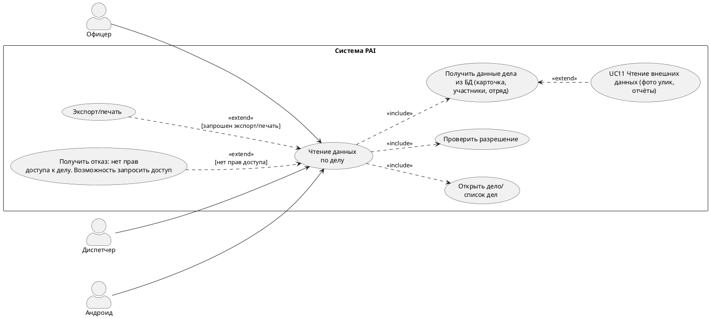

```plantuml-svg
@startuml
left to right direction
skinparam actorStyle awesome
skinparam nodesep 60
skinparam ranksep 60

actor "Офицер" as Officer
actor "Диспетчер" as Dispatcher
actor "Андроид" as Android

rectangle "Система PAI" {
  usecase "Чтение данных\nпо делу" as UC9

  usecase "Открыть дело/\nсписок дел" as UC9_Open
  usecase "Проверить разрешение" as UC9_Check
  usecase "Получить данные дела\nиз БД (карточка,\nучастники, отряд)" as UC9_Fetch

  usecase "UC11 Чтение внешних\nданных (фото улик,\nотчёты)" as UC11
  usecase "Экспорт/печать" as UC9_Export

  usecase "Получить отказ: нет прав\nдоступа к делу. Возможность запросить доступ" as UC9_Deny
}

Officer --> UC9
Dispatcher --> UC9
Android --> UC9

UC9 ..> UC9_Open : <<include>>
UC9 ..> UC9_Check : <<include>>
UC9 ..> UC9_Fetch : <<include>>
UC9_Fetch <.. UC11 : <<extend>>

UC9_Deny ..> UC9 : <<extend>>\n[нет прав доступа]
UC9_Export ..> UC9 : <<extend>>\n[запрошен экспорт/печать]

@enduml

```