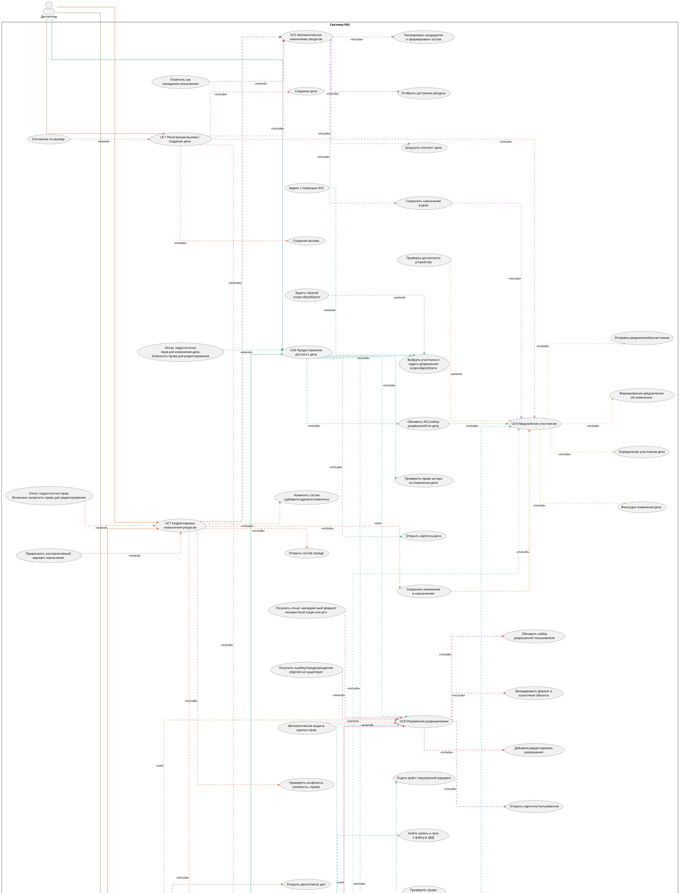

```plantuml-svg
@startuml
left to right direction
skinparam linetype ortho
skinparam actorStyle awesome
skinparam nodesep 200
skinparam ranksep 200

actor "Диспетчер" as Dispatcher
actor "Офицер полиции" as Officer
actor "Андроид" as Android
actor "Администратор" as Admin
actor "Система логирования" as LogSys

rectangle "Система PAI" {

' ---------- UC1 ----------
usecase "UC1 Регистрация вызова /\nсоздание дела" as UC1
usecase "Создание вызова" as UC1_CreateCall
usecase "Создание дела" as UC1_CreateCase
usecase "Уточнение по вызову" as UC1_Clarify

UC1 ..[#E74C3C]> UC1_CreateCall : <<include>>
UC1 ..[#E74C3C]> UC1_CreateCase : <<include>>
UC1_Clarify ..[#E74C3C]> UC1 : <<extend>>

' ---------- UC2 ----------
usecase "UC2 Работа с уликами\n(создание/привязка/проверка/ред.)" as UC2
usecase "Загрузка (создание) улик\nв систему" as UC2_Upload
usecase "Привязать улику\nк делу" as UC2_Link
usecase "Изменить/удалить\nулику" as UC2_Edit
usecase "Проверка и подтверждение\nулик" as UC2_Verify
usecase "Формирование предварительного отчёта" as UC2_Template

UC2 ..[#2980B9]> UC2_Upload : <<include>>
UC2 ..[#2980B9]> UC2_Link   : <<include>>
UC2 ..[#2980B9]> UC2_Edit   : <<include>>
UC2 ..[#2980B9]> UC2_Verify : <<include>>
UC2_Template ..[#2980B9]> UC2_Verify : <<extend>>
UC2_Edit     ..[#2980B9]> UC2_Verify : <<extend>>

' ---------- UC3 ----------
usecase "UC3 Подготовка и\nподписание отчёта" as UC3
usecase "Формирование шаблона\nс подстановкой данных" as UC3_Generate
usecase "Редактирование отчёта" as UC3_Edit
usecase "Подписать отчёт" as UC3_Sign
usecase "Загрузка дополнительных\nматериалов" as UC3_Extend

UC3 ..[#27AE60]> UC3_Generate : <<include>>
UC3 ..[#27AE60]> UC3_Edit     : <<include>>
UC3 ..[#27AE60]> UC3_Sign     : <<include>>
UC3_Extend ..[#27AE60]> UC3_Edit : <<extend>>

' ---------- UC4 ----------
usecase "UC4 Уведомление участников" as UC4
usecase "Фиксация изменения дела" as UC4_Trigger
usecase "Определение участников дела" as UC4_GetParts
usecase "Формирование уведомления\nоб изменении" as UC4_Make
usecase "Отправка уведомленийnучастникам" as UC4_Send
usecase "Проверка доступности\nустройства" as UC4_CheckDelivery

UC4 ..[#F39C12]> UC4_Trigger   : <<include>>
UC4 ..[#F39C12]> UC4_GetParts  : <<include>>
UC4 ..[#F39C12]> UC4_Make      : <<include>>
UC4 ..[#F39C12]> UC4_Send      : <<include>>
UC4_CheckDelivery ..[#F39C12]> UC4 : <<extend>>

' ---------- UC5 ----------
usecase "UC5 Автоматическое\nназначение ресурсов" as UC5
usecase "Загрузить контекст дела" as UC5_LoadCtx
usecase "Отобрать доступные ресурсы" as UC5_Select
usecase "Ранжировать кандидатов\nи сформировать состав" as UC5_Rank
usecase "Сохранить назначение\nв деле" as UC5_Persist
usecase "Пометить как\n«ожидание назначения»" as UC5_Wait

UC5 ..[#8E44AD]> UC5_LoadCtx  : <<include>>
UC5 ..[#8E44AD]> UC5_Select   : <<include>>
UC5 ..[#8E44AD]> UC5_Rank     : <<include>>
UC5 ..[#8E44AD]> UC5_Persist  : <<include>>
UC5_Wait ..[#8E44AD]> UC5     : <<extend>>

' ---------- UC6 ----------
usecase "UC6 Предоставление\nдоступа к делу" as UC6
usecase "Открыть карточку дела" as UC6_OpenCase
usecase "Выбрать участника и\nзадать разрешение\nscope:objectId:priv" as UC6_SelectPerm
usecase "Проверить право актора\nна изменение дела" as UC6_CheckRights
usecase "Обновить ACL/набор\nразрешений по делу" as UC6_UpdateACL
usecase "Отказ: недостаточно\nправ для изменения дела.\nЗапросить права для редактирования" as UC6_Deny
usecase "Задать с помощью GUI" as UC6_GUI
usecase "Задать строкой\nscope:objectId:priv" as UC6_Raw

UC6 ..[#16A085]> UC6_OpenCase   : <<include>>
UC6 ..[#16A085]> UC6_SelectPerm : <<include>>
UC6 ..[#16A085]> UC6_CheckRights: <<include>>
UC6 ..[#16A085]> UC6_UpdateACL  : <<include>>
UC6_Deny ..[#16A085]> UC6       : <<extend>>
UC6_GUI  ..[#16A085]> UC6_SelectPerm : <<extend>>
UC6_Raw  ..[#16A085]> UC6_SelectPerm : <<extend>>

' ---------- UC7 ----------
usecase "UC7 Корректировка\nназначения ресурсов" as UC7
usecase "Открыть состав отряда" as UC7_Open
usecase "Изменить состав\n(добавить/удалить/заменить)" as UC7_Edit
usecase "Проверить конфликты\n(занятость, права)" as UC7_Check
usecase "Сохранить изменения\nв назначениях" as UC7_Save
usecase "Отказ: недостаточно прав.\nВозможно запросить права для редактирования" as UC7_Deny
usecase "Предложить альтернативный\nвариант назначения" as UC7_Alt

UC7 ..[#D35400]> UC7_Open : <<include>>
UC7 ..[#D35400]> UC7_Edit : <<include>>
UC7 ..[#D35400]> UC7_Check: <<include>>
UC7 ..[#D35400]> UC7_Save : <<include>>
UC7_Deny ..[#D35400]> UC7 : <<extend>>
UC7_Alt  ..[#D35400]> UC7 : <<extend>>

' ---------- UC8 ----------
usecase "UC8 Управление разрешениями" as UC8
usecase "Открыть карточку пользователя" as UC8_OpenUser
usecase "Добавить/редактировать\nразрешения" as UC8_EditPerms
usecase "Валидировать формат и\nссылочные объекты" as UC8_Validate
usecase "Обновить набор\nразрешений пользователя" as UC8_Update
usecase "Получить отказ: некорректный формат/\nнеизвестный scope или priv" as UC8_DenyInvalid
usecase "Получить ошибку/предупреждение:\nobjectId не существует" as UC8_ObjectIssue
usecase "Автоматическая выдача\nнужных прав" as UC8_AutoGrant

UC8 ..[#C2185B]> UC8_OpenUser  : <<include>>
UC8 ..[#C2185B]> UC8_EditPerms : <<include>>
UC8 ..[#C2185B]> UC8_Validate  : <<include>>
UC8 ..[#C2185B]> UC8_Update    : <<include>>
UC8_DenyInvalid ..[#C2185B]> UC8 : <<extend>>
UC8_ObjectIssue ..[#C2185B]> UC8 : <<extend>>
UC8_AutoGrant ..[#C2185B]> UC8   : <<extend>>

' ---------- UC9 ----------
usecase "UC9 Чтение данных по делу" as UC9
usecase "Открыть дело/список дел" as UC9_Open
usecase "Проверить разрешение" as UC9_Check
usecase "Получить данные дела\nиз БД (карточка,\nучастники, отряд)" as UC9_Fetch
usecase "Экспорт/печать" as UC9_Export
usecase "Получить отказ: нет прав\nдоступа к делу. Возможность запросить доступ" as UC9_Deny

UC9 ..[#7D6608]> UC9_Open  : <<include>>
UC9 ..[#7D6608]> UC9_Check : <<include>>
UC9 ..[#7D6608]> UC9_Fetch : <<include>>
UC9_Export ..[#7D6608]> UC9 : <<extend>>
UC9_Deny   ..[#7D6608]> UC9 : <<extend>>

' ---------- UC10 ----------
usecase "UC10 Логирование" as UC10
usecase "Записать access-лог" as UC10_Access
usecase "Записать аудиторную запись" as UC10_Audit
usecase "Записать error-лог" as UC10_Error
usecase "Просмотр и анализ логов" as UC10_View
usecase "Метрики по логам" as UC10_Metrics

UC10 ..[#7F8C8D]> UC10_Access : <<include>>
UC10 ..[#7F8C8D]> UC10_Audit  : <<include>>
UC10 ..[#7F8C8D]> UC10_Error  : <<include>>
UC10_Metrics ..[#7F8C8D]> UC10 : <<extend>>
UC10_View    ..[#7F8C8D]> UC10 : <<extend>>

' ---------- UC11 ----------
usecase "UC11 Чтение внешних данных\n(отчёты/файлы улик)" as UC11
usecase "Отправить запрос\nна получение данных" as UC11_Request
usecase "Проверить право\nна просмотр дела" as UC11_Check
usecase "Найти запись и путь\nк файлу в ЦБД" as UC11_Locate
usecase "Отдать файл / внутренний редирект" as UC11_Deliver
usecase "Получить отказ: нет прав\nили файл не найден. Возможно запросить права" as UC11_Deny

UC11 ..[#17A2B8]> UC11_Request : <<include>>
UC11 ..[#17A2B8]> UC11_Check   : <<include>>
UC11 ..[#17A2B8]> UC11_Locate  : <<include>>
UC11 ..[#17A2B8]> UC11_Deliver : <<include>>
UC11_Deny ..[#17A2B8]> UC11 : <<extend>>

' ---------- UC12 ----------
usecase "UC12 Сохранение отчёта\nв ЦБД" as UC12
usecase "Проверить полноту и\nвалидность данных" as UC12_Validate
usecase "Сохранить запись отчёта\nи метаданные" as UC12_SaveMeta
usecase "Сохранить вложения" as UC12_SaveFiles
usecase "Получить отказ: отчёт\nнеполный" as UC12_Deny

UC12 ..[#2ECC71]> UC12_Validate : <<include>>
UC12 ..[#2ECC71]> UC12_SaveMeta : <<include>>
UC12 ..[#2ECC71]> UC12_SaveFiles: <<include>>
UC12_Deny ..[#2ECC71]> UC12 : <<extend>>

}

' ===== Акторы → UC (цвет по UC) =====
Dispatcher -[#E74C3C]-> UC1
Dispatcher -[#16A085]-> UC6
Dispatcher -[#D35400]-> UC7
Dispatcher -[#7D6608]-> UC9

Officer -[#2980B9]-> UC2
Officer -[#27AE60]-> UC3
Officer -[#16A085]-> UC6
Officer -[#D35400]-> UC7
Officer -[#7D6608]-> UC9
Officer -[#17A2B8]-> UC11
Officer -[#2ECC71]-> UC12

Android -[#7D6608]-> UC9
Android -[#17A2B8]-> UC11
Android -[#2980B9]-> UC2

Admin -[#C2185B]-> UC8
Admin -[#7F8C8D]-> UC10

LogSys -[#7F8C8D]-> UC10

' ===== Меж-UC связи (цвет по UC-источнику) =====
UC1 ..[#E74C3C]> UC5 : <<include>>
UC1 ..[#E74C3C]> UC4 : <<include>>

UC5_Persist ..[#8E44AD]> UC4 : <<include>>
UC7_Save    ..[#D35400]> UC4 : <<include>>
UC6_UpdateACL ..[#16A085]> UC4 : <<include>>
UC2 ..[#2980B9]> UC4 : <<include>>
UC12 ..[#2ECC71]> UC4 : <<include>>

UC7 ..> UC5 : <<extends>>

UC3 ..[#27AE60]> UC12 : <<include>>

UC9 ..[#7D6608]> UC11 : <<include>>

UC11 ..[#17A2B8]> UC10 : <<include>>
UC9  ..[#7D6608]> UC10 : <<include>>
UC6  ..[#16A085]> UC10 : <<include>>
UC7  ..[#D35400]> UC10 : <<include>>
UC2  ..[#2980B9]> UC10 : <<include>>
UC12 ..[#2ECC71]> UC10 : <<include>>
UC1  ..[#E74C3C]> UC10 : <<include>>

UC9 ..[#7D6608]> UC8 : <<use>>
UC11 ..[#17A2B8]> UC8 : <<use>>
UC6  ..[#16A085]> UC8 : <<use>>

@enduml

```